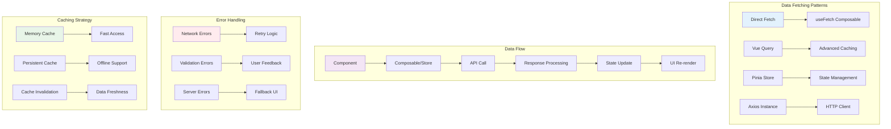
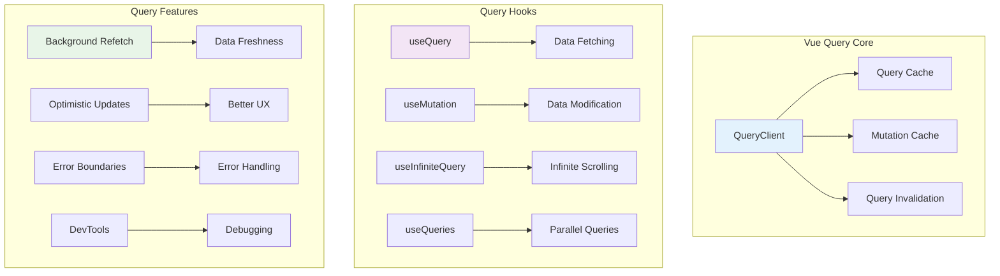
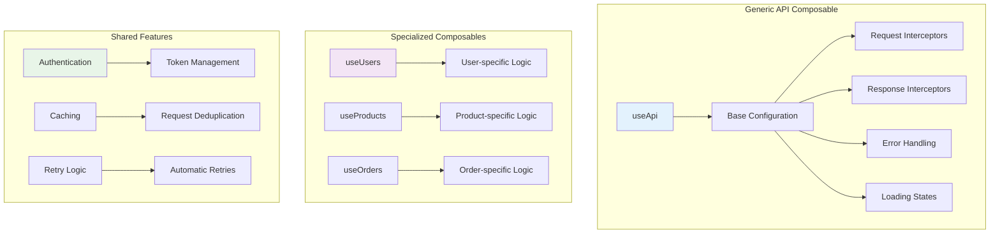
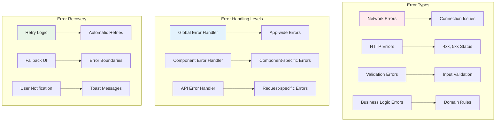
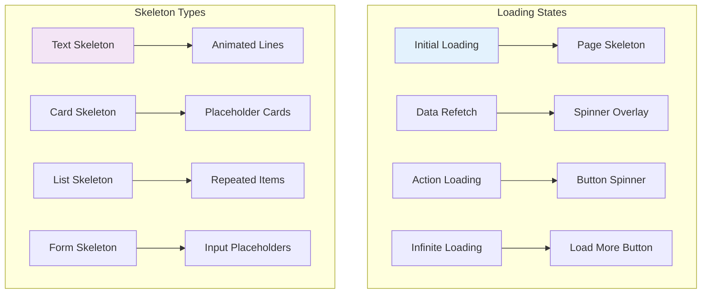

# API Integration & Data Fetching in Vue 3 🌐

## Data Fetching Architecture

This diagram shows the different patterns and tools for API integration in Vue 3 applications.



## Vue Query Integration

### Vue Query Architecture



### Vue Query Implementation

```typescript
// composables/useUsers.ts
import { useQuery, useMutation, useQueryClient } from '@tanstack/vue-query'
import { ref, computed } from 'vue'

export function useUsers() {
  const queryClient = useQueryClient()
  
  // Fetch users query
  const {
    data: users,
    isLoading,
    isError,
    error,
    refetch
  } = useQuery({
    queryKey: ['users'],
    queryFn: async () => {
      const response = await fetch('/api/users')
      if (!response.ok) {
        throw new Error('Failed to fetch users')
      }
      return response.json()
    },
    staleTime: 5 * 60 * 1000, // 5 minutes
    cacheTime: 10 * 60 * 1000, // 10 minutes
    retry: 3,
    retryDelay: (attemptIndex) => Math.min(1000 * 2 ** attemptIndex, 30000)
  })
  
  // Create user mutation
  const createUserMutation = useMutation({
    mutationFn: async (userData: CreateUserData) => {
      const response = await fetch('/api/users', {
        method: 'POST',
        headers: { 'Content-Type': 'application/json' },
        body: JSON.stringify(userData)
      })
      if (!response.ok) {
        throw new Error('Failed to create user')
      }
      return response.json()
    },
    onSuccess: () => {
      // Invalidate and refetch users
      queryClient.invalidateQueries({ queryKey: ['users'] })
    },
    onError: (error) => {
      console.error('Create user failed:', error)
    }
  })
  
  // Update user mutation
  const updateUserMutation = useMutation({
    mutationFn: async ({ id, data }: { id: string; data: UpdateUserData }) => {
      const response = await fetch(`/api/users/${id}`, {
        method: 'PUT',
        headers: { 'Content-Type': 'application/json' },
        body: JSON.stringify(data)
      })
      if (!response.ok) {
        throw new Error('Failed to update user')
      }
      return response.json()
    },
    onMutate: async ({ id, data }) => {
      // Cancel outgoing refetches
      await queryClient.cancelQueries({ queryKey: ['users'] })
      
      // Snapshot previous value
      const previousUsers = queryClient.getQueryData(['users'])
      
      // Optimistically update
      queryClient.setQueryData(['users'], (old: any) => 
        old?.map((user: any) => 
          user.id === id ? { ...user, ...data } : user
        )
      )
      
      return { previousUsers }
    },
    onError: (err, variables, context) => {
      // Rollback on error
      if (context?.previousUsers) {
        queryClient.setQueryData(['users'], context.previousUsers)
      }
    },
    onSettled: () => {
      // Refetch after error or success
      queryClient.invalidateQueries({ queryKey: ['users'] })
    }
  })
  
  // Delete user mutation
  const deleteUserMutation = useMutation({
    mutationFn: async (id: string) => {
      const response = await fetch(`/api/users/${id}`, {
        method: 'DELETE'
      })
      if (!response.ok) {
        throw new Error('Failed to delete user')
      }
    },
    onSuccess: () => {
      queryClient.invalidateQueries({ queryKey: ['users'] })
    }
  })
  
  // Computed properties
  const userCount = computed(() => users.value?.length || 0)
  const activeUsers = computed(() => 
    users.value?.filter((user: any) => user.isActive) || []
  )
  
  return {
    // Query state
    users,
    isLoading,
    isError,
    error,
    refetch,
    // Mutations
    createUser: createUserMutation.mutate,
    updateUser: updateUserMutation.mutate,
    deleteUser: deleteUserMutation.mutate,
    // Mutation states
    isCreating: createUserMutation.isPending,
    isUpdating: updateUserMutation.isPending,
    isDeleting: deleteUserMutation.isPending,
    // Computed
    userCount,
    activeUsers
  }
}
```

## Custom Composable Patterns

### Generic API Composable



### Custom Composable Implementation

```typescript
// composables/useApi.ts
import { ref, computed } from 'vue'
import type { Ref } from 'vue'

interface ApiState<T> {
  data: Ref<T | null>
  loading: Ref<boolean>
  error: Ref<string | null>
  isSuccess: Ref<boolean>
}

interface ApiOptions {
  immediate?: boolean
  retries?: number
  retryDelay?: number
  onSuccess?: (data: any) => void
  onError?: (error: Error) => void
}

export function useApi<T = any>(
  apiCall: () => Promise<T>,
  options: ApiOptions = {}
): ApiState<T> & { execute: () => Promise<void>; reset: () => void } {
  const {
    immediate = false,
    retries = 3,
    retryDelay = 1000,
    onSuccess,
    onError
  } = options

  const data = ref<T | null>(null)
  const loading = ref(false)
  const error = ref<string | null>(null)
  const isSuccess = ref(false)

  const execute = async (): Promise<void> => {
    loading.value = true
    error.value = null
    isSuccess.value = false

    let lastError: Error | null = null

    for (let attempt = 0; attempt <= retries; attempt++) {
      try {
        const result = await apiCall()
        data.value = result
        isSuccess.value = true
        onSuccess?.(result)
        return
      } catch (err) {
        lastError = err instanceof Error ? err : new Error('Unknown error')
        
        if (attempt < retries) {
          await new Promise(resolve => setTimeout(resolve, retryDelay * (attempt + 1)))
        }
      }
    }

    error.value = lastError?.message || 'Request failed'
    onError?.(lastError!)
  }

  const reset = () => {
    data.value = null
    loading.value = false
    error.value = null
    isSuccess.value = false
  }

  // Execute immediately if requested
  if (immediate) {
    execute()
  }

  return {
    data,
    loading,
    error,
    isSuccess,
    execute,
    reset
  }
}

// Specialized composable using the generic one
export function useUsers() {
  const fetchUsers = () => 
    fetch('/api/users').then(res => {
      if (!res.ok) throw new Error('Failed to fetch users')
      return res.json()
    })

  const {
    data: users,
    loading,
    error,
    isSuccess,
    execute: fetchUsersData,
    reset
  } = useApi(fetchUsers, {
    immediate: true,
    onSuccess: (data) => {
      console.log('Users loaded:', data.length)
    },
    onError: (error) => {
      console.error('Failed to load users:', error)
    }
  })

  const userCount = computed(() => users.value?.length || 0)

  return {
    users,
    loading,
    error,
    isSuccess,
    userCount,
    refetch: fetchUsersData,
    reset
  }
}
```

## Error Handling Patterns

### Error Handling Architecture



### Error Handling Implementation

```typescript
// utils/errorHandler.ts
export class ApiError extends Error {
  constructor(
    message: string,
    public status?: number,
    public code?: string,
    public details?: any
  ) {
    super(message)
    this.name = 'ApiError'
  }
}

export class ValidationError extends ApiError {
  constructor(message: string, public field?: string, details?: any) {
    super(message, 400, 'VALIDATION_ERROR', details)
    this.name = 'ValidationError'
  }
}

export class NetworkError extends ApiError {
  constructor(message: string = 'Network error occurred') {
    super(message, 0, 'NETWORK_ERROR')
    this.name = 'NetworkError'
  }
}

// Error handler utility
export function handleApiError(error: unknown): string {
  if (error instanceof ValidationError) {
    return `Validation error: ${error.message}`
  }
  
  if (error instanceof ApiError) {
    return `API error: ${error.message}`
  }
  
  if (error instanceof NetworkError) {
    return 'Network error. Please check your connection.'
  }
  
  if (error instanceof Error) {
    return error.message
  }
  
  return 'An unexpected error occurred'
}

// Global error handler
export function setupGlobalErrorHandler() {
  window.addEventListener('unhandledrejection', (event) => {
    console.error('Unhandled promise rejection:', event.reason)
    // Send to error reporting service
    reportError(event.reason)
  })
  
  window.addEventListener('error', (event) => {
    console.error('Global error:', event.error)
    // Send to error reporting service
    reportError(event.error)
  })
}

function reportError(error: any) {
  // Send to error reporting service (e.g., Sentry)
  if (typeof gtag !== 'undefined') {
    gtag('event', 'exception', {
      description: error.message || 'Unknown error',
      fatal: false
    })
  }
}
```

```vue
<!-- ErrorBoundary.vue -->
<template>
  <div v-if="hasError" class="error-boundary">
    <div class="error-content">
      <h2>Something went wrong</h2>
      <p>{{ errorMessage }}</p>
      <button @click="retry" class="retry-button">
        Try Again
      </button>
    </div>
  </div>
  <slot v-else />
</template>

<script setup lang="ts">
import { ref, onErrorCaptured } from 'vue'
import { handleApiError } from '@/utils/errorHandler'

const hasError = ref(false)
const errorMessage = ref('')

onErrorCaptured((error) => {
  hasError.value = true
  errorMessage.value = handleApiError(error)
  
  // Log error for debugging
  console.error('Error caught by boundary:', error)
  
  // Prevent error from propagating
  return false
})

const retry = () => {
  hasError.value = false
  errorMessage.value = ''
}
</script>

<style scoped>
.error-boundary {
  display: flex;
  align-items: center;
  justify-content: center;
  min-height: 200px;
  padding: 2rem;
}

.error-content {
  text-align: center;
  max-width: 400px;
}

.retry-button {
  margin-top: 1rem;
  padding: 0.5rem 1rem;
  background: #007bff;
  color: white;
  border: none;
  border-radius: 4px;
  cursor: pointer;
}
</style>
```

## Loading States and Skeleton UI

### Loading State Patterns



### Loading Implementation

```vue
<!-- SkeletonLoader.vue -->
<template>
  <div class="skeleton-loader">
    <div v-if="type === 'text'" class="skeleton-text">
      <div 
        v-for="i in lines" 
        :key="i"
        class="skeleton-line"
        :style="{ width: getRandomWidth() }"
      />
    </div>
    
    <div v-else-if="type === 'card'" class="skeleton-card">
      <div class="skeleton-avatar" />
      <div class="skeleton-content">
        <div class="skeleton-line" style="width: 80%" />
        <div class="skeleton-line" style="width: 60%" />
        <div class="skeleton-line" style="width: 40%" />
      </div>
    </div>
    
    <div v-else-if="type === 'list'" class="skeleton-list">
      <div 
        v-for="i in count" 
        :key="i"
        class="skeleton-item"
      >
        <div class="skeleton-avatar" />
        <div class="skeleton-content">
          <div class="skeleton-line" style="width: 70%" />
          <div class="skeleton-line" style="width: 50%" />
        </div>
      </div>
    </div>
  </div>
</template>

<script setup lang="ts">
interface Props {
  type: 'text' | 'card' | 'list'
  lines?: number
  count?: number
}

const props = withDefaults(defineProps<Props>(), {
  lines: 3,
  count: 5
})

const getRandomWidth = () => {
  const widths = ['60%', '70%', '80%', '90%', '100%']
  return widths[Math.floor(Math.random() * widths.length)]
}
</script>

<style scoped>
.skeleton-loader {
  animation: pulse 1.5s ease-in-out infinite;
}

.skeleton-line,
.skeleton-avatar {
  background: linear-gradient(90deg, #f0f0f0 25%, #e0e0e0 50%, #f0f0f0 75%);
  background-size: 200% 100%;
  animation: loading 1.5s infinite;
  border-radius: 4px;
}

.skeleton-line {
  height: 16px;
  margin-bottom: 8px;
}

.skeleton-avatar {
  width: 40px;
  height: 40px;
  border-radius: 50%;
  margin-right: 12px;
}

.skeleton-card {
  display: flex;
  padding: 16px;
  border: 1px solid #e0e0e0;
  border-radius: 8px;
  margin-bottom: 16px;
}

.skeleton-content {
  flex: 1;
}

.skeleton-list {
  display: flex;
  flex-direction: column;
  gap: 12px;
}

.skeleton-item {
  display: flex;
  align-items: center;
  padding: 12px;
  border: 1px solid #e0e0e0;
  border-radius: 8px;
}

@keyframes loading {
  0% {
    background-position: 200% 0;
  }
  100% {
    background-position: -200% 0;
  }
}

@keyframes pulse {
  0%, 100% {
    opacity: 1;
  }
  50% {
    opacity: 0.5;
  }
}
</style>
```

```vue
<!-- DataList.vue -->
<template>
  <div class="data-list">
    <!-- Loading state -->
    <div v-if="loading" class="loading-container">
      <SkeletonLoader type="list" :count="5" />
    </div>
    
    <!-- Error state -->
    <div v-else-if="error" class="error-container">
      <div class="error-message">
        <h3>Failed to load data</h3>
        <p>{{ error }}</p>
        <button @click="refetch" class="retry-button">
          Try Again
        </button>
      </div>
    </div>
    
    <!-- Success state -->
    <div v-else class="data-container">
      <div v-for="item in data" :key="item.id" class="data-item">
        
        <div class="content">
          <h4>{{ item.name }}</h4>
          <p>{{ item.email }}</p>
        </div>
      </div>
      
      <!-- Load more button -->
      <div v-if="hasMore" class="load-more">
        <button 
          @click="loadMore" 
          :disabled="loadingMore"
          class="load-more-button"
        >
          <span v-if="loadingMore">Loading...</span>
          <span v-else>Load More</span>
        </button>
      </div>
    </div>
  </div>
</template>

<script setup lang="ts">
import { ref, computed } from 'vue'
import { useUsers } from '@/composables/useUsers'
import SkeletonLoader from '@/components/SkeletonLoader.vue'

const {
  users,
  loading,
  error,
  refetch,
  userCount
} = useUsers()

const loadingMore = ref(false)
const page = ref(1)
const pageSize = 10

const data = computed(() => users.value || [])
const hasMore = computed(() => data.value.length < userCount.value)

const loadMore = async () => {
  loadingMore.value = true
  try {
    // Load more data logic
    page.value++
    // ... fetch more data
  } finally {
    loadingMore.value = false
  }
}
</script>

<style scoped>
.data-list {
  max-width: 600px;
  margin: 0 auto;
}

.loading-container,
.error-container {
  padding: 2rem;
}

.data-item {
  display: flex;
  align-items: center;
  padding: 1rem;
  border: 1px solid #e0e0e0;
  border-radius: 8px;
  margin-bottom: 0.5rem;
}

.avatar {
  width: 40px;
  height: 40px;
  border-radius: 50%;
  margin-right: 1rem;
}

.content h4 {
  margin: 0 0 0.25rem 0;
  font-size: 1rem;
}

.content p {
  margin: 0;
  color: #666;
  font-size: 0.875rem;
}

.load-more {
  text-align: center;
  margin-top: 1rem;
}

.load-more-button {
  padding: 0.5rem 1rem;
  background: #007bff;
  color: white;
  border: none;
  border-radius: 4px;
  cursor: pointer;
}

.load-more-button:disabled {
  background: #ccc;
  cursor: not-allowed;
}

.error-message {
  text-align: center;
}

.retry-button {
  margin-top: 1rem;
  padding: 0.5rem 1rem;
  background: #dc3545;
  color: white;
  border: none;
  border-radius: 4px;
  cursor: pointer;
}
</style>
```

---

**Next Steps**: Learn about [Production Deployment](./production-deployment.md) to understand how to deploy Vue 3 applications to production environments.
