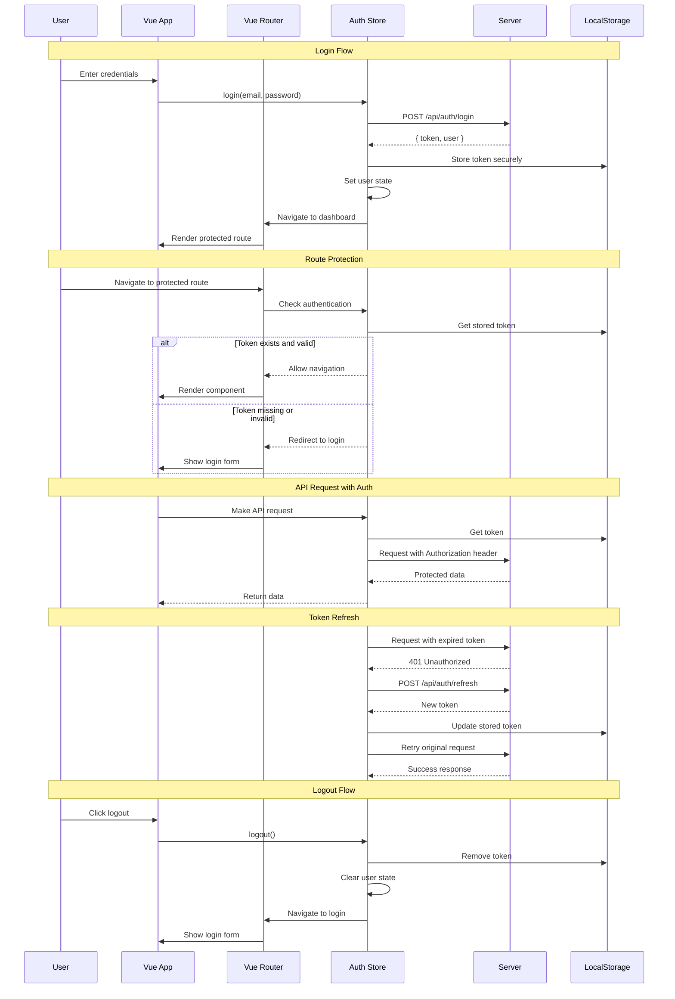
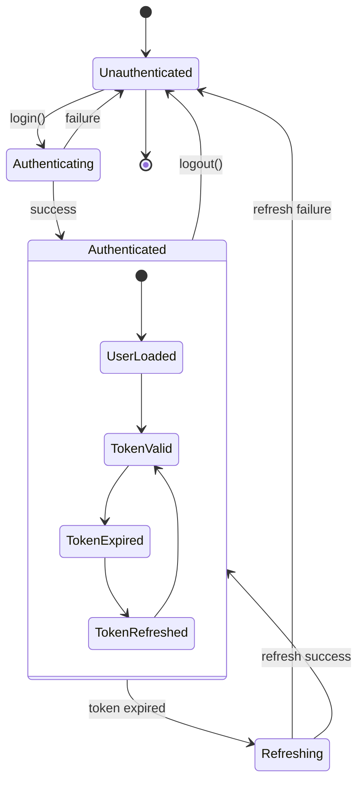
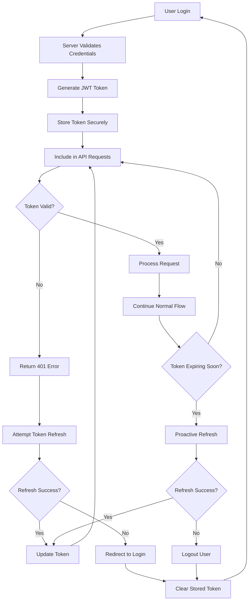
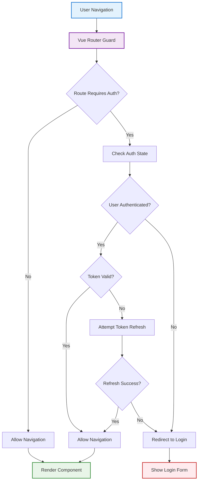
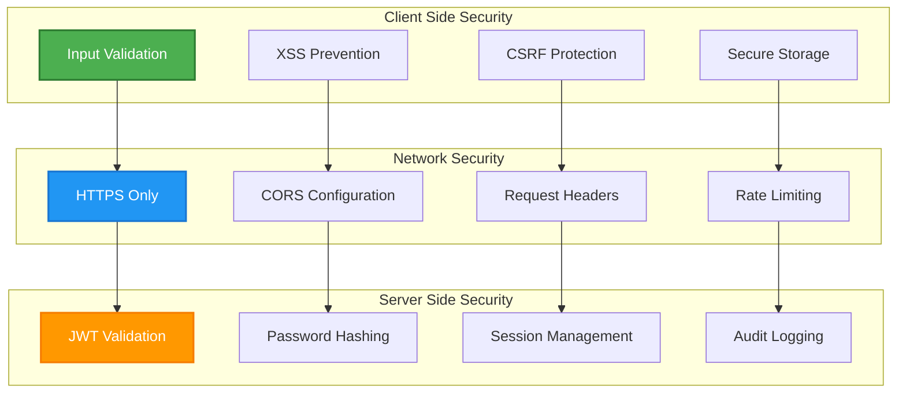
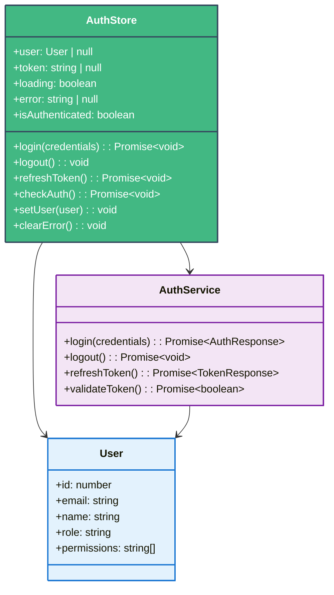
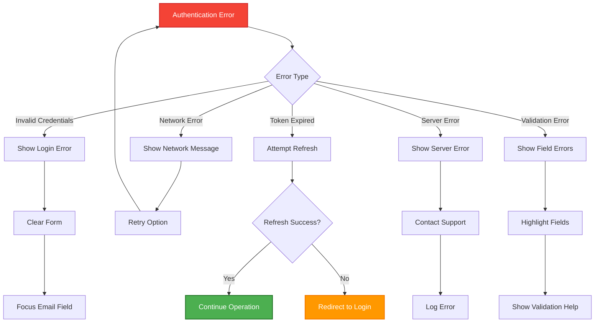

# Vue Authentication Flow 🔐

## TypeScript Auth System Architecture

This diagram illustrates the complete authentication flow in Vue 3 applications with TypeScript, including JWT token management, route protection, and security best practices.

## Authentication State Management

## JWT Token Lifecycle

## Route Protection Architecture

## Security Layers

## Pinia Store Structure

## Error Handling Flow

## Implementation Checklist

### Client Side
- [ ] Input validation and sanitization
- [ ] Secure token storage (httpOnly cookies preferred)
- [ ] XSS prevention in user content
- [ ] CSRF token implementation
- [ ] Route guards for protected pages
- [ ] Automatic token refresh
- [ ] Proper error handling and user feedback

### Server Side
- [ ] JWT token generation and validation
- [ ] Password hashing (bcrypt/Argon2)
- [ ] Rate limiting on auth endpoints
- [ ] CORS configuration
- [ ] HTTPS enforcement
- [ ] Audit logging
- [ ] Session management

### Security Best Practices
- [ ] Use secure, random JWT secrets
- [ ] Implement token expiration
- [ ] Use refresh tokens for long sessions
- [ ] Validate all inputs server-side
- [ ] Implement proper CORS policies
- [ ] Use Content Security Policy (CSP)
- [ ] Regular security audits

---

**Related Resources**:
- [Security Guide](../extras/security_guide.md) - Complete security practices
- [State Management](../extras/state_management.md) - Pinia patterns
- [Vue Router Navigation](./vue_router_navigation.md) - Route protection
