# Vue 3 Component Lifecycle 🔄

## Component Lifecycle Hooks Overview

This diagram shows the complete lifecycle of a Vue 3 component from creation to destruction.

```mermaid
graph TD
    A[Component Creation] --> B[setup() function]
    B --> C[beforeCreate]
    C --> D[created]
    D --> E[beforeMount]
    E --> F[mounted]

    F --> G[Component Active]
    G --> H[Data Changes]
    H --> I[beforeUpdate]
    I --> J[updated]
    J --> G

    G --> K[Component Destruction]
    K --> L[beforeUnmount]
    L --> M[unmounted]

    subgraph "Composition API Hooks"
        N[onBeforeMount]
        O[onMounted]
        P[onBeforeUpdate]
        Q[onUpdated]
        R[onBeforeUnmount]
        S[onUnmounted]
    end

    B --> N
    N --> O
    O --> P
    P --> Q
    Q --> R
    R --> S

    style A fill:#e3f2fd
    style F fill:#e8f5e8
    style G fill:#fff3e0
    style M fill:#ffebee
```

## Detailed Lifecycle Phases

### 1. Creation Phase


### 2. Update Phase


### 3. Destruction Phase


## Composition API Lifecycle Hooks

### Hook Usage Patterns


## Lifecycle Hook Examples

### Basic Component with Lifecycle

```vue
<script setup lang="ts">
import {
  onBeforeMount,
  onMounted,
  onBeforeUpdate,
  onUpdated,
  onBeforeUnmount,
  onUnmounted
} from 'vue'

// Creation phase
onBeforeMount(() => {
  console.log('Component is about to be mounted')
})

onMounted(() => {
  console.log('Component is mounted to DOM')
  // Perfect for:
  // - API calls
  // - DOM manipulation
  // - Event listeners
  // - Timers
})

// Update phase
onBeforeUpdate(() => {
  console.log('Component is about to update')
})

onUpdated(() => {
  console.log('Component has been updated')
  // Perfect for:
  // - DOM operations after updates
  // - Logging changes
})

// Destruction phase
onBeforeUnmount(() => {
  console.log('Component is about to be unmounted')
  // Perfect for:
  // - Cleanup timers
  // - Remove event listeners
  // - Cancel API requests
})

onUnmounted(() => {
  console.log('Component has been unmounted')
})
</script>
```

## Common Use Cases by Lifecycle Phase

### Mounting Phase Use Cases


### Update Phase Use Cases


### Unmounting Phase Use Cases


## Lifecycle Best Practices

### Do's and Don'ts

```mermaid
graph LR
    subgraph "✅ Do"
        A[Use onMounted for API calls]
        B[Clean up in onBeforeUnmount]
        C[Use onUpdated sparingly]
        D[Handle errors with onErrorCaptured]
    end

    subgraph "❌ Don't"
        E[Modify reactive data in onMounted]
        F[Forget to clean up resources]
        G[Use onUpdated for side effects]
        H[Ignore error handling]
    end

    style A fill:#e8f5e8
    style B fill:#e8f5e8
    style C fill:#e8f5e8
    style D fill:#e8f5e8
    style E fill:#ffebee
    style F fill:#ffebee
    style G fill:#ffebee
    style H fill:#ffebee
```



## Lifecycle vs React Hooks Comparison

### Vue 3 vs React Lifecycle

```mermaid
graph TB
    subgraph "Vue 3 Lifecycle"
        A[onMounted]
        B[onUpdated]
        C[onUnmounted]
    end

    subgraph "React Hooks"
        D[useEffect with empty deps]
        E[useEffect with deps]
        F[useEffect cleanup]
    end

    subgraph "Equivalent Patterns"
        G[onMounted ≈ useEffect(() => {}, [])]
        H[onUpdated ≈ useEffect(() => {}, [deps])]
        I[onUnmounted ≈ useEffect cleanup]
    end

    A --> G
    B --> H
    C --> I

    style A fill:#e3f2fd
    style D fill:#f3e5f5
    style G fill:#e8f5e8
```

## Advanced Lifecycle Patterns

### Conditional Lifecycle Hooks

```vue
<script setup lang="ts">
import { onMounted, onUnmounted } from 'vue'

// Conditional mounting based on props
const props = defineProps<{
  enableTracking: boolean
}>()

let intervalId: number | null = null

onMounted(() => {
  if (props.enableTracking) {
    // Start tracking only if enabled
    intervalId = setInterval(() => {
      console.log('Tracking...')
    }, 1000)
  }
})

onBeforeUnmount(() => {
  if (intervalId) {
    clearInterval(intervalId)
  }
})
</script>
```

### Lifecycle with Async Operations

```vue
<script setup lang="ts">
import { ref, onMounted, onBeforeUnmount } from 'vue'

const data = ref(null)
const loading = ref(false)
let abortController: AbortController | null = null

onMounted(async () => {
  loading.value = true
  abortController = new AbortController()

  try {
    const response = await fetch('/api/data', {
      signal: abortController.signal
    })
    data.value = await response.json()
  } catch (error) {
    if (error.name !== 'AbortError') {
      console.error('Failed to fetch data:', error)
    }
  } finally {
    loading.value = false
  }
})

onBeforeUnmount(() => {
  // Cancel ongoing requests
  if (abortController) {
    abortController.abort()
  }
})
</script>
```

## Lifecycle Debugging

### Debugging Lifecycle Issues


---

**Next Steps**: Learn about [Reactivity System](./reactivity-system.md) to understand how Vue 3's reactive data system works under the hood.
