# Vue 3 Course Roadmap 🗺️

## Complete Learning Path Overview

This diagram shows the complete learning journey from Vue 3 fundamentals to full-stack application development.

```mermaid
graph TD
    A[🎯 Prerequisites<br/>JavaScript ES6+ Review] --> B[📚 Lesson 1<br/>Vue 3 Fundamentals<br/>& TypeScript Setup]
    B --> C[🏗️ Lesson 2<br/>Component Architecture<br/>& Reactive State]
    C --> D[🌐 Lesson 3<br/>API Integration<br/>& Data Management]
    D --> E[🔐 Lesson 4<br/>Routing, Authentication<br/>& Advanced Patterns]
    E --> F[🚀 Lesson 5<br/>Full-Stack Integration<br/>& Production Deployment]

    B --> B1[📖 Theory: Vue 3 Concepts]
    B --> B2[🧪 Lab: Student Dashboard]
    B --> B3[📝 Quiz: Fundamentals]

    C --> C1[📖 Theory: Component Patterns]
    C --> C2[🧪 Lab: Component Library]
    C --> C3[📝 Quiz: Architecture]

    D --> D1[📖 Theory: API Integration]
    D --> D2[🧪 Lab: CRUD Application]
    D --> D3[📝 Quiz: Data Management]

    E --> E1[📖 Theory: Routing & Auth]
    E --> E2[🧪 Lab: Auth System]
    E --> E3[📝 Quiz: Advanced Patterns]

    F --> F1[📖 Theory: Full-Stack]
    F --> F2[🧪 Lab: Complete App]
    F --> F3[📝 Quiz: Deployment]

    G[📚 Advanced Materials] --> G1[State Management Guide]
    G --> G2[Testing Strategies]
    G --> G3[Performance Optimization]
    G --> G4[Security Best Practices]

    F --> G

    style A fill:#e1f5fe
    style B fill:#f3e5f5
    style C fill:#e8f5e8
    style D fill:#fff3e0
    style E fill:#fce4ec
    style F fill:#f1f8e9
    style G fill:#e0f2f1
```

## Learning Progression

### Phase 1: Foundations (Lessons 0-1)
- **Prerequisites**: JavaScript ES6+ review
- **Vue 3 Basics**: Components, templates, reactivity
- **TypeScript**: Type safety and modern development
- **Tools**: Vite, VS Code, development environment

### Phase 2: Core Development (Lessons 2-3)
- **Component Architecture**: Reusable, composable components
- **State Management**: Local state, Pinia stores
- **API Integration**: REST APIs, data fetching
- **Forms & Validation**: User input handling

### Phase 3: Advanced Features (Lessons 4-5)
- **Routing**: Vue Router, navigation, protected routes
- **Authentication**: JWT, user management
- **Real-time**: WebSockets, live updates
- **Deployment**: Production-ready applications

## Skills Development Timeline

## Prerequisites & Dependencies

## Assessment & Milestones

### Knowledge Checkpoints
- **Quiz 0**: JavaScript ES6+ fundamentals
- **Quiz 1**: Vue 3 basics and TypeScript
- **Quiz 2**: Component architecture patterns
- **Quiz 3**: API integration and data management
- **Quiz 4**: Routing, authentication, and advanced patterns
- **Quiz 5**: Full-stack development and deployment

### Practical Milestones
- **Lab 1**: Student Dashboard application
- **Lab 2**: Advanced component library
- **Lab 3**: CRUD application with API
- **Lab 4**: Authentication system
- **Lab 5**: Complete full-stack application

### Final Project
Build a complete, production-ready Vue 3 application that demonstrates:
- Modern component architecture
- State management with Pinia
- API integration with backend
- Authentication and authorization
- Responsive design
- Testing and deployment

## Learning Resources

### Primary Materials
- **Theory Files**: In-depth concept explanations
- **Lab Exercises**: Hands-on coding practice
- **Reference Guides**: Quick lookup materials
- **Quizzes**: Knowledge validation

### Additional Resources
- **Advanced Patterns**: Enterprise-level techniques
- **Testing Guide**: Comprehensive testing strategies
- **Performance Guide**: Optimization techniques
- **Troubleshooting**: Common issues and solutions

## Success Metrics

### Technical Skills
- [ ] Can build Vue 3 applications from scratch
- [ ] Understands component composition patterns
- [ ] Can integrate with REST APIs
- [ ] Implements authentication and routing
- [ ] Deploys applications to production

### Professional Skills
- [ ] Follows modern development practices
- [ ] Writes clean, maintainable code
- [ ] Uses TypeScript effectively
- [ ] Implements responsive design
- [ ] Applies testing strategies

### Career Readiness
- [ ] Portfolio-ready projects
- [ ] Understanding of full-stack development
- [ ] Knowledge of modern tooling
- [ ] Experience with production deployment
- [ ] Problem-solving abilities

---

**Next Steps**: Start with [Lesson 0: Prerequisites](../lesson0-prerequisites/readme.md) if you need to review JavaScript fundamentals, or jump directly to [Lesson 1: Vue 3 Fundamentals](../lesson1-setup/readme.md) if you're ready to begin!
