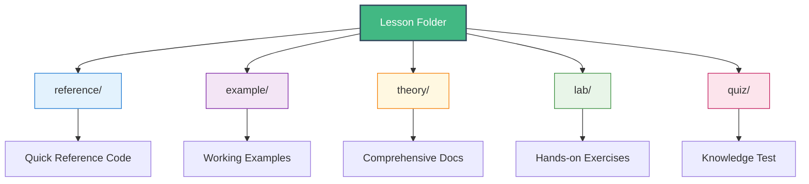
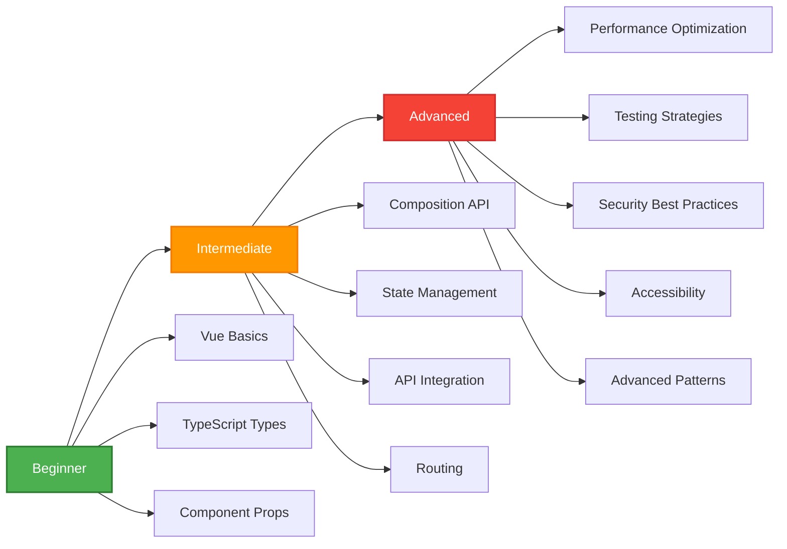

# Vue Course Structure Diagram 📊

## Complete TypeScript Course Organization & Navigation

This diagram shows the complete structure of the Vue 3 with TypeScript course, including all lessons, resources, and learning paths.

```mermaid
graph TD
    A[Vue Course - LongNDT] --> B[Prerequisites]
    A --> C[Core Lessons]
    A --> D[Advanced Materials]
    A --> E[Visual Diagrams]

    B --> B1[Lesson 0: TypeScript Prerequisites]
    B1 --> B1a[TypeScript Essentials]
    B1 --> B1b[Interfaces & Generics]
    B1 --> B1c[Lab Project]

    C --> C1[Lesson 1: Vue Fundamentals]
    C --> C2[Lesson 2: Component Architecture]
    C --> C3[Lesson 3: API Integration]
    C --> C4[Lesson 4: Routing & Authentication]
    C --> C5[Lesson 5: Full-Stack Deployment]

    C1 --> C1a[Vite Setup]
    C1 --> C1b[Vue Components]
    C1 --> C1c[TypeScript Integration]
    C1 --> C1d[Lab: Welcome Page]

    C2 --> C2a[Composition API]
    C2 --> C2b[Props & Events]
    C2 --> C2c[Custom Composables]
    C2 --> C2d[Lab: Data Management]

    C3 --> C3a[API Consumption]
    C3 --> C3b[Error Handling]
    C3 --> C3c[Data Fetching]
    C3 --> C3d[Lab: CRUD Application]

    C4 --> C4a[Vue Router]
    C4 --> C4b[JWT Authentication]
    C4 --> C4c[Protected Routes]
    C4 --> C4d[Lab: Auth System]

    C5 --> C5a[VENM Stack]
    C5 --> C5b[File Uploads]
    C5 --> C5c[WebSockets]
    C5 --> C5d[Lab: Full Deployment]

    D --> D1[Advanced Patterns]
    D --> D2[Performance Optimization]
    D --> D3[State Management]
    D --> D4[Security Guide]
    D --> D5[Accessibility]
    D --> D6[Testing Strategies]
    D --> D7[Environment Setup]
    D --> D8[Troubleshooting]

    E --> E1[Course Roadmap]
    E --> E2[Component Lifecycle]
    E --> E3[State Management Flow]
    E --> E4[API Integration Flow]
    E --> E5[Authentication Flow]
    E --> E6[Vue 3 Architecture]
    E --> E7[Project Structure]
    E --> E8[Router Navigation]
    E --> E9[Deployment Flow]

    style A fill:#42b883,stroke:#35495e,stroke-width:3px,color:#fff
    style B fill:#e1f5fe,stroke:#01579b,stroke-width:2px
    style C fill:#f3e5f5,stroke:#4a148c,stroke-width:2px
    style D fill:#fff3e0,stroke:#e65100,stroke-width:2px
    style E fill:#e8f5e8,stroke:#2e7d32,stroke-width:2px
```

## Learning Path Flow

```mermaid
flowchart LR
    Start([Start Learning]) --> TS{Need TypeScript?}
    TS -->|Yes| L0[Lesson 0: TypeScript]
    TS -->|No| L1[Lesson 1: Vue Fundamentals]
    L0 --> L1
    L1 --> L2[Lesson 2: Components]
    L2 --> L3[Lesson 3: API Integration]
    L3 --> L4[Lesson 4: Routing & Auth]
    L4 --> L5[Lesson 5: Full-Stack]
    L5 --> Advanced[Advanced Materials]
    Advanced --> Capstone[Capstone Project]
    Capstone --> Complete([Course Complete])

    style Start fill:#4caf50,stroke:#2e7d32,stroke-width:2px,color:#fff
    style Complete fill:#4caf50,stroke:#2e7d32,stroke-width:2px,color:#fff
    style L0 fill:#ff9800,stroke:#f57c00,stroke-width:2px,color:#fff
    style L1 fill:#2196f3,stroke:#1976d2,stroke-width:2px,color:#fff
    style L2 fill:#9c27b0,stroke:#7b1fa2,stroke-width:2px,color:#fff
    style L3 fill:#f44336,stroke:#d32f2f,stroke-width:2px,color:#fff
    style L4 fill:#795548,stroke:#5d4037,stroke-width:2px,color:#fff
    style L5 fill:#607d8b,stroke:#455a64,stroke-width:2px,color:#fff
```

## Lesson Structure

Each lesson follows a consistent structure:

## Skill Progression

## Resource Dependencies

```mermaid
graph TD
    Core[Core Lessons] --> Extras[Advanced Materials]
    Core --> Diagrams[Visual Diagrams]

    Extras --> Patterns[Advanced Patterns]
    Extras --> Performance[Performance Optimization]
    Extras --> State[State Management]
    Extras --> Security[Security Guide]
    Extras --> Accessibility[Accessibility Guide]
    Extras --> Testing[Testing Strategies]
    Extras --> Setup[Environment Setup]
    Extras --> Troubleshooting[Troubleshooting]

    Diagrams --> Roadmap[Course Roadmap]
    Diagrams --> Lifecycle[Component Lifecycle]
    Diagrams --> StateFlow[State Management Flow]
    Diagrams --> APIFlow[API Integration Flow]
    Diagrams --> AuthFlow[Authentication Flow]
    Diagrams --> Architecture[Vue 3 Architecture]
    Diagrams --> Project[Project Structure]
    Diagrams --> Router[Router Navigation]
    Diagrams --> Deployment[Deployment Flow]

    style Core fill:#42b883,stroke:#35495e,stroke-width:3px,color:#fff
    style Extras fill:#ff9800,stroke:#f57c00,stroke-width:2px,color:#fff
    style Diagrams fill:#2196f3,stroke:#1976d2,stroke-width:2px,color:#fff
```

## Navigation Tips

1. **Start with Prerequisites** - Complete TypeScript basics if needed
2. **Follow Sequential Order** - Lessons build upon each other
3. **Use Visual Diagrams** - Reference diagrams while learning
4. **Practice with Labs** - Hands-on exercises solidify learning
5. **Test Knowledge** - Take quizzes to verify understanding
6. **Explore Advanced Materials** - Deepen knowledge after core lessons

---

**Next Steps**: Start with [Course Roadmap](./course_roadmap.md) to understand your learning journey!
