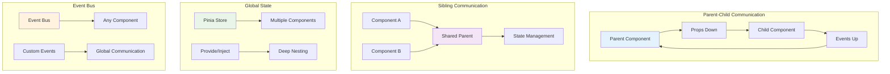
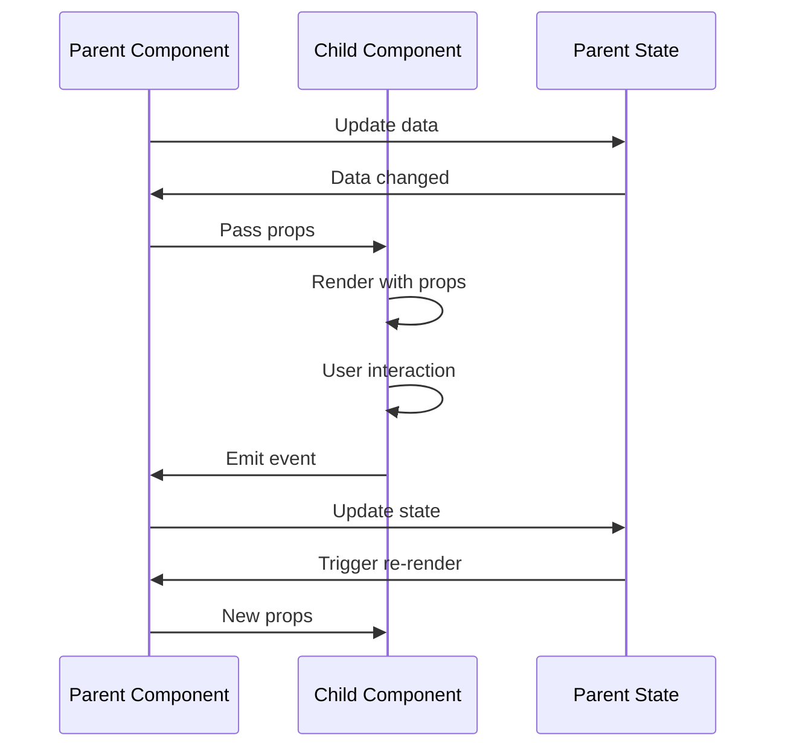
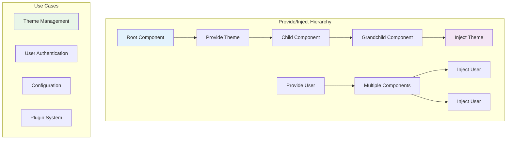
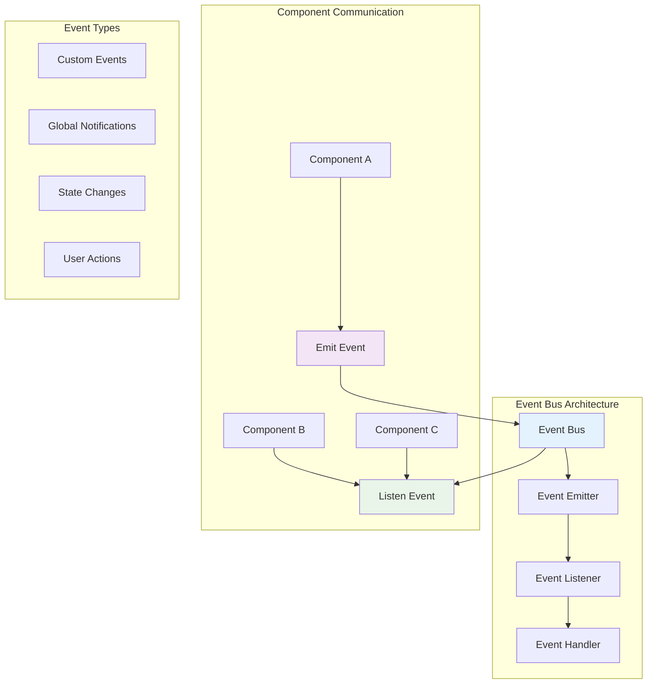
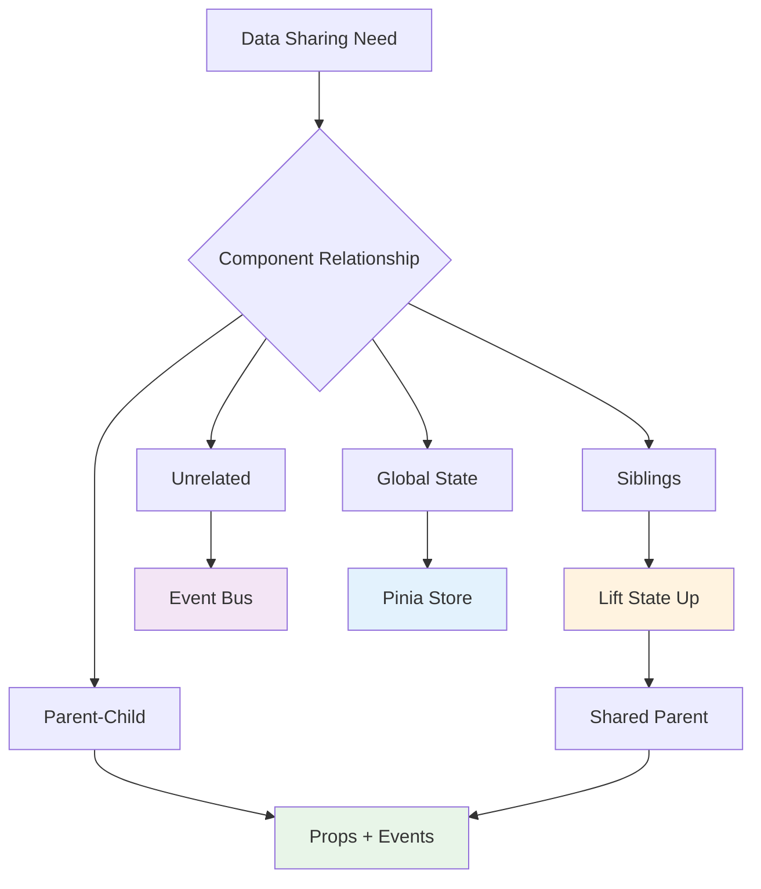
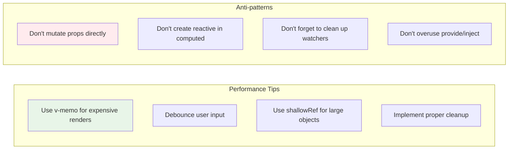

# Data Flow Patterns in Vue 3 🔄

## Component Communication Patterns

This diagram shows the different ways components can communicate and share data in Vue 3 applications.



## Props Down, Events Up Pattern

### Basic Parent-Child Communication



### Props and Events Implementation

```vue
<!-- Parent Component -->
<template>
  <div>
    <h2>Parent: {{ count }}</h2>
    <ChildComponent
      :count="count"
      :message="message"
      @increment="handleIncrement"
      @update-message="handleMessageUpdate"
    />
  </div>
</template>

<script setup lang="ts">
import { ref } from 'vue'
import ChildComponent from './ChildComponent.vue'

const count = ref(0)
const message = ref('Hello from parent')

const handleIncrement = () => {
  count.value++
}

const handleMessageUpdate = (newMessage: string) => {
  message.value = newMessage
}
</script>
```

```vue
<!-- Child Component -->
<template>
  <div>
    <h3>Child: {{ count }}</h3>
    <p>{{ message }}</p>
    <button @click="increment">Increment</button>
    <input
      :value="message"
      @input="updateMessage"
      placeholder="Update message"
    />
  </div>
</template>

<script setup lang="ts">
interface Props {
  count: number
  message: string
}

const props = defineProps<Props>()

const emit = defineEmits<{
  increment: []
  'update-message': [message: string]
}>()

const increment = () => {
  emit('increment')
}

const updateMessage = (event: Event) => {
  const target = event.target as HTMLInputElement
  emit('update-message', target.value)
}
</script>
```

## Provide/Inject Pattern

### Deep Component Communication



### Provide/Inject Implementation

```vue
<!-- Root Component (Provider) -->
<template>
  <div class="app">
    <Header />
    <Main />
    <Footer />
  </div>
</template>

<script setup lang="ts">
import { provide, ref } from 'vue'
import Header from './Header.vue'
import Main from './Main.vue'
import Footer from './Footer.vue'

// Provide theme
const theme = ref('light')
const toggleTheme = () => {
  theme.value = theme.value === 'light' ? 'dark' : 'light'
}

provide('theme', {
  theme,
  toggleTheme
})

// Provide user data
const user = ref({
  name: 'John Doe',
  email: 'john@example.com'
})

provide('user', user)
</script>
```

```vue
<!-- Deep Child Component (Consumer) -->
<template>
  <div :class="`component ${theme.theme}`">
    <h3>Welcome, {{ user.name }}</h3>
    <button @click="theme.toggleTheme">
      Toggle Theme
    </button>
  </div>
</template>

<script setup lang="ts">
import { inject } from 'vue'

// Inject theme
const theme = inject('theme', {
  theme: ref('light'),
  toggleTheme: () => {}
})

// Inject user
const user = inject('user', ref({ name: 'Guest', email: '' }))
</script>
```

## Pinia State Management

### Global State Pattern

```mermaid
graph TB
    subgraph "Pinia Store Architecture"
        A[Store Definition] --> B[State]
        A --> C[Getters]
        A --> D[Actions]
    end

    subgraph "Component Usage"
        E[Component A] --> F[useStore()]
        G[Component B] --> F
        H[Component C] --> F
        F --> I[Shared State]
    end

    subgraph "State Flow"
        I --> J[Reactive Updates]
        J --> K[UI Re-render]
        K --> L[User Interaction]
        L --> M[Action Dispatch]
        M --> I
    end

    style A fill:#e3f2fd
    style F fill:#f3e5f5
    style I fill:#e8f5e8
```

### Pinia Store Implementation

```typescript
// stores/user.ts
import { defineStore } from 'pinia'
import { ref, computed } from 'vue'

export const useUserStore = defineStore('user', () => {
  // State
  const users = ref<User[]>([])
  const currentUser = ref<User | null>(null)
  const loading = ref(false)

  // Getters
  const isAuthenticated = computed(() => currentUser.value !== null)
  const userCount = computed(() => users.value.length)

  // Actions
  const fetchUsers = async () => {
    loading.value = true
    try {
      const response = await fetch('/api/users')
      users.value = await response.json()
    } catch (error) {
      console.error('Failed to fetch users:', error)
    } finally {
      loading.value = false
    }
  }

  const login = async (credentials: LoginCredentials) => {
    loading.value = true
    try {
      const response = await fetch('/api/login', {
        method: 'POST',
        headers: { 'Content-Type': 'application/json' },
        body: JSON.stringify(credentials)
      })
      currentUser.value = await response.json()
    } catch (error) {
      throw new Error('Login failed')
    } finally {
      loading.value = false
    }
  }

  const logout = () => {
    currentUser.value = null
  }

  return {
    // State
    users,
    currentUser,
    loading,
    // Getters
    isAuthenticated,
    userCount,
    // Actions
    fetchUsers,
    login,
    logout
  }
})
```

```vue
<!-- Component using the store -->
<template>
  <div>
    <div v-if="loading">Loading...</div>
    <div v-else-if="isAuthenticated">
      <h2>Welcome, {{ currentUser?.name }}</h2>
      <p>Total users: {{ userCount }}</p>
      <button @click="logout">Logout</button>
    </div>
    <div v-else>
      <button @click="handleLogin">Login</button>
    </div>
  </div>
</template>

<script setup lang="ts">
import { useUserStore } from '@/stores/user'

const userStore = useUserStore()
const { currentUser, loading, isAuthenticated, userCount, login, logout } = userStore

const handleLogin = async () => {
  try {
    await login({ email: 'user@example.com', password: 'password' })
  } catch (error) {
    console.error('Login failed:', error)
  }
}
</script>
```

## Event Bus Pattern

### Global Event Communication



### Event Bus Implementation

```typescript
// utils/eventBus.ts
import { ref } from 'vue'

type EventCallback = (...args: any[]) => void

class EventBus {
  private events: Record<string, EventCallback[]> = {}

  on(event: string, callback: EventCallback) {
    if (!this.events[event]) {
      this.events[event] = []
    }
    this.events[event].push(callback)
  }

  off(event: string, callback: EventCallback) {
    if (!this.events[event]) return

    const index = this.events[event].indexOf(callback)
    if (index > -1) {
      this.events[event].splice(index, 1)
    }
  }

  emit(event: string, ...args: any[]) {
    if (!this.events[event]) return

    this.events[event].forEach(callback => {
      callback(...args)
    })
  }
}

export const eventBus = new EventBus()
```

```vue
<!-- Component A (Event Emitter) -->
<template>
  <div>
    <button @click="notifyUsers">Notify All Users</button>
    <button @click="updateTheme">Update Theme</button>
  </div>
</template>

<script setup lang="ts">
import { eventBus } from '@/utils/eventBus'

const notifyUsers = () => {
  eventBus.emit('user-notification', {
    message: 'New update available!',
    type: 'info'
  })
}

const updateTheme = () => {
  eventBus.emit('theme-change', 'dark')
}
</script>
```

```vue
<!-- Component B (Event Listener) -->
<template>
  <div>
    <div v-if="notification" class="notification">
      {{ notification.message }}
    </div>
  </div>
</template>

<script setup lang="ts">
import { ref, onMounted, onUnmounted } from 'vue'
import { eventBus } from '@/utils/eventBus'

const notification = ref(null)

const handleNotification = (data: any) => {
  notification.value = data
  setTimeout(() => {
    notification.value = null
  }, 3000)
}

const handleThemeChange = (theme: string) => {
  document.body.className = theme
}

onMounted(() => {
  eventBus.on('user-notification', handleNotification)
  eventBus.on('theme-change', handleThemeChange)
})

onUnmounted(() => {
  eventBus.off('user-notification', handleNotification)
  eventBus.off('theme-change', handleThemeChange)
})
</script>
```

## Data Flow Best Practices

### Pattern Selection Guide



### Performance Considerations



## Common Data Flow Patterns

### Form Data Pattern

```vue
<template>
  <form @submit.prevent="handleSubmit">
    <input
      v-model="form.name"
      placeholder="Name"
      :class="{ error: errors.name }"
    />
    <span v-if="errors.name">{{ errors.name }}</span>

    <input
      v-model="form.email"
      placeholder="Email"
      :class="{ error: errors.email }"
    />
    <span v-if="errors.email">{{ errors.email }}</span>

    <button type="submit" :disabled="!isValid">
      Submit
    </button>
  </form>
</template>

<script setup lang="ts">
import { reactive, computed } from 'vue'

const form = reactive({
  name: '',
  email: ''
})

const errors = reactive({
  name: '',
  email: ''
})

const isValid = computed(() => {
  return form.name && form.email && !errors.name && !errors.email
})

const validateForm = () => {
  errors.name = form.name ? '' : 'Name is required'
  errors.email = form.email ? '' : 'Email is required'
}

const handleSubmit = () => {
  validateForm()
  if (isValid.value) {
    console.log('Form submitted:', form)
  }
}
</script>
```

### API Data Pattern

```vue
<template>
  <div>
    <div v-if="loading">Loading...</div>
    <div v-else-if="error">{{ error }}</div>
    <div v-else>
      <div v-for="item in data" :key="item.id">
        {{ item.name }}
      </div>
    </div>
  </div>
</template>

<script setup lang="ts">
import { ref, onMounted } from 'vue'

const data = ref([])
const loading = ref(false)
const error = ref(null)

const fetchData = async () => {
  loading.value = true
  error.value = null

  try {
    const response = await fetch('/api/data')
    data.value = await response.json()
  } catch (err) {
    error.value = err.message
  } finally {
    loading.value = false
  }
}

onMounted(fetchData)
</script>
```

---

**Next Steps**: Learn about [Pinia State Management](./pinia-state-management.md) to understand advanced state management patterns in Vue 3 applications.
