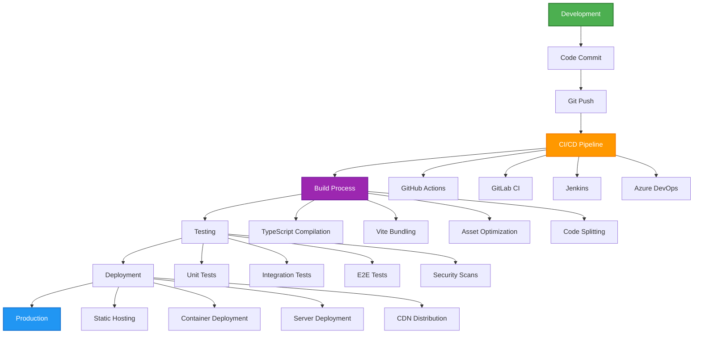
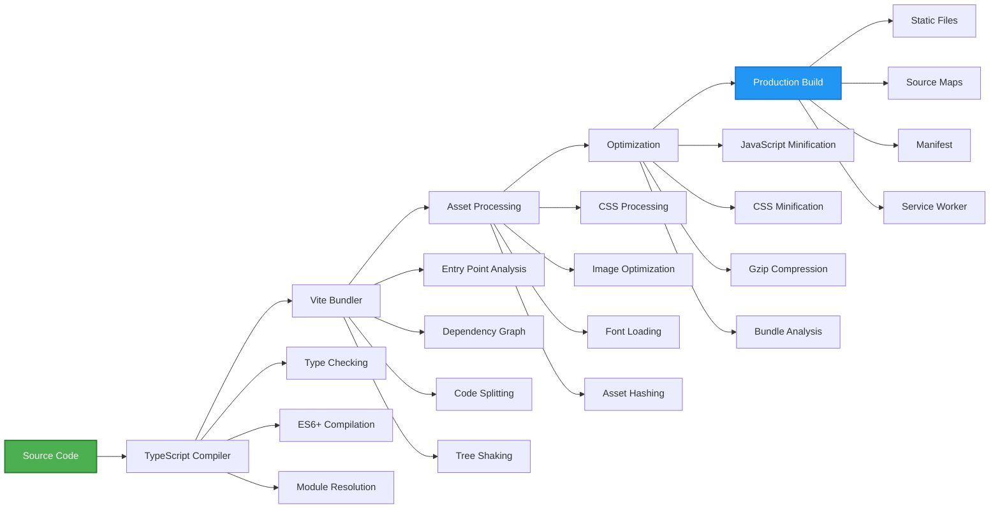
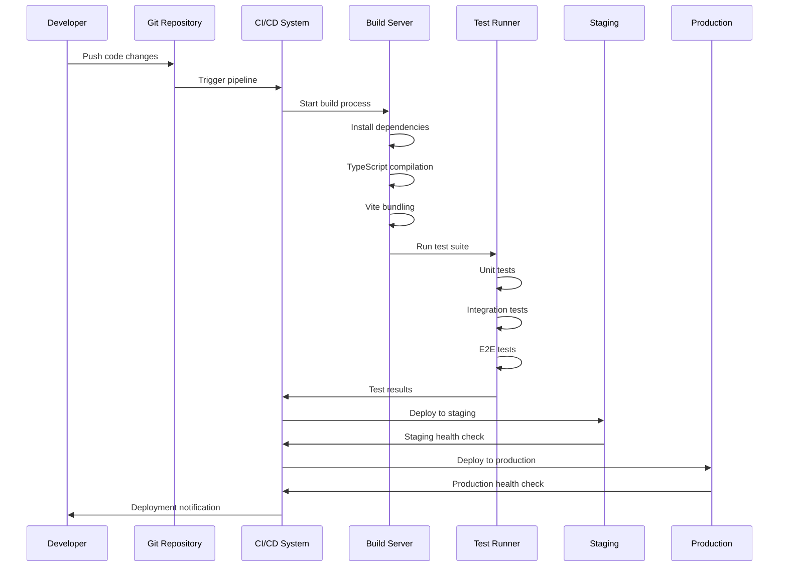
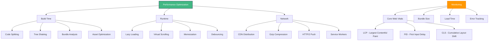
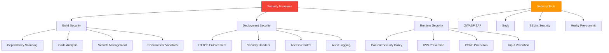
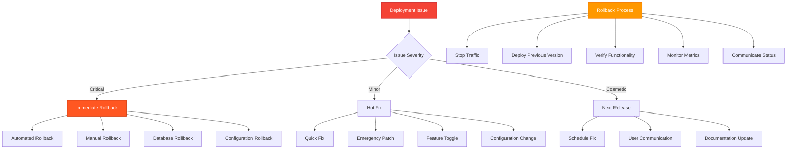

# Vue Deployment Flow 🚀

## TypeScript Deployment Process

This diagram illustrates the complete deployment process for Vue 3 applications with TypeScript, from development to production, including CI/CD pipelines and deployment strategies.

## Build Process Details

## CI/CD Pipeline

## Deployment Strategies

```mermaid
graph TD
    A[Deployment Strategy] --> B[Static Hosting]
    A --> C[Container Deployment]
    A --> D[Server Deployment]
    A --> E[Serverless Deployment]

    B --> B1[Vercel]
    B --> B2[Netlify]
    B --> B3[GitHub Pages]
    B --> B4[AWS S3 + CloudFront]

    C --> C1[Docker Container]
    C --> C2[Kubernetes]
    C --> C3[Docker Compose]
    C --> C4[Container Registry]

    D --> D1[Nginx]
    D --> D2[Apache]
    D --> D3[PM2]
    D --> D4[Systemd Service]

    E --> E1[AWS Lambda]
    E --> E2[Vercel Functions]
    E --> E3[Netlify Functions]
    E --> E4[Azure Functions]

    style A fill:#42b883,stroke:#35495e,stroke-width:2px,color:#fff
    style B fill:#e3f2fd,stroke:#1976d2,stroke-width:1px
    style C fill:#f3e5f5,stroke:#7b1fa2,stroke-width:1px
    style D fill:#fff8e1,stroke:#f57c00,stroke-width:1px
    style E fill:#e8f5e8,stroke:#388e3c,stroke-width:1px
```

## Environment Configuration

```mermaid
graph TD
    A[Environment] --> B[Development]
    A --> C[Staging]
    A --> D[Production]

    B --> B1[Local Development]
    B --> B2[Hot Reload]
    B --> B3[Debug Mode]
    B --> B4[Mock APIs]

    C --> C1[Testing Environment]
    C --> C2[Staging APIs]
    C --> C3[Performance Testing]
    C --> C4[User Acceptance Testing]

    D --> D1[Live Environment]
    D --> D2[Production APIs]
    D --> D3[Monitoring]
    D --> D4[Analytics]

    E[Environment Variables] --> F[API_URL]
    E --> G[DATABASE_URL]
    E --> H[SECRET_KEY]
    E --> I[FEATURE_FLAGS]

    F --> F1[dev: http://localhost:3000]
    F --> F2[staging: https://staging-api.com]
    F --> F3[prod: https://api.com]

    style A fill:#42b883,stroke:#35495e,stroke-width:2px,color:#fff
    style B fill:#4caf50,stroke:#2e7d32,stroke-width:1px,color:#fff
    style C fill:#ff9800,stroke:#f57c00,stroke-width:1px,color:#fff
    style D fill:#f44336,stroke:#d32f2f,stroke-width:1px,color:#fff
```

## Performance Optimization

## Security Considerations

## Monitoring and Analytics

```mermaid
graph TD
    A[Monitoring Stack] --> B[Application Monitoring]
    A --> C[Performance Monitoring]
    A --> D[Error Tracking]
    A --> E[User Analytics]

    B --> B1[Uptime Monitoring]
    B --> B2[Response Time]
    B --> B3[Throughput]
    B --> B4[Resource Usage]

    C --> C1[Core Web Vitals]
    C --> C2[Bundle Size]
    C --> C3[Load Time]
    C --> C4[Render Performance]

    D --> D1[Error Logging]
    D --> D2[Stack Traces]
    D --> D3[User Context]
    D --> D4[Error Aggregation]

    E --> E1[User Behavior]
    E --> E2[Feature Usage]
    E --> E3[Conversion Tracking]
    E --> E4[A/B Testing]

    F[Tools] --> G[Sentry]
    F --> H[Google Analytics]
    F --> I[New Relic]
    F --> J[DataDog]

    style A fill:#42b883,stroke:#35495e,stroke-width:2px,color:#fff
    style F fill:#ff9800,stroke:#f57c00,stroke-width:2px,color:#fff
```

## Rollback Strategy

## Deployment Checklist

### Pre-Deployment
- [ ] All tests passing
- [ ] Code review completed
- [ ] Security scan passed
- [ ] Performance benchmarks met
- [ ] Documentation updated
- [ ] Environment variables configured
- [ ] Database migrations ready
- [ ] Backup strategy in place

### During Deployment
- [ ] Deploy to staging first
- [ ] Run smoke tests
- [ ] Monitor application health
- [ ] Check error rates
- [ ] Verify performance metrics
- [ ] Test critical user flows
- [ ] Monitor resource usage

### Post-Deployment
- [ ] Verify all features working
- [ ] Monitor error rates
- [ ] Check performance metrics
- [ ] Validate user feedback
- [ ] Monitor business metrics
- [ ] Update monitoring dashboards
- [ ] Document any issues
- [ ] Plan next iteration

---

**Related Resources**:
- [Performance Optimization](../extras/performance_optimization.md) - Complete optimization guide
- [Security Guide](../extras/security_guide.md) - Security best practices
- [Environment Setup](../extras/environment_setup.md) - Development environment
- [Troubleshooting Guide](../extras/troubleshooting_guide.md) - Common deployment issues
