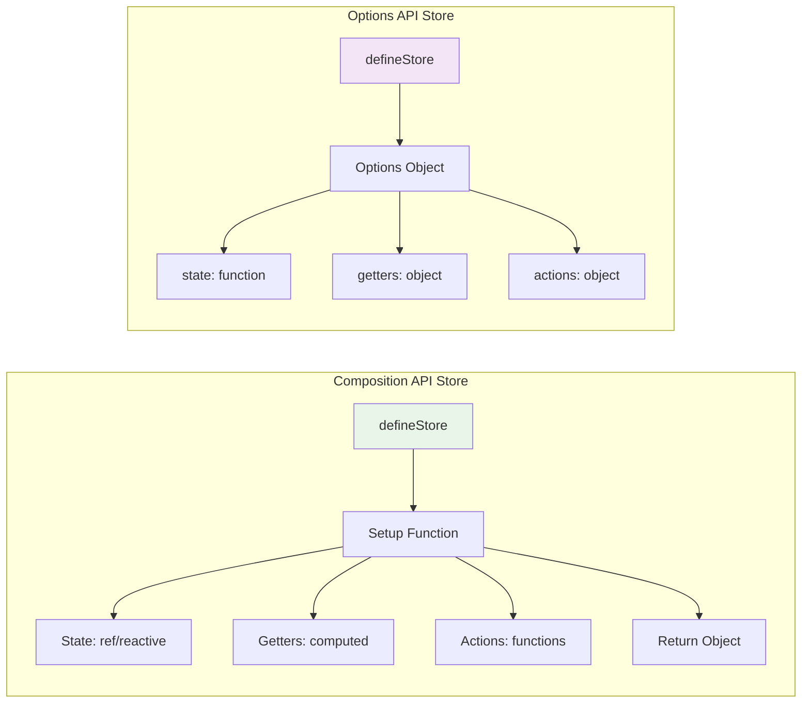
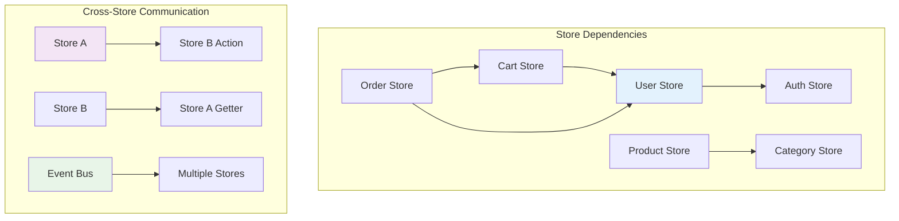
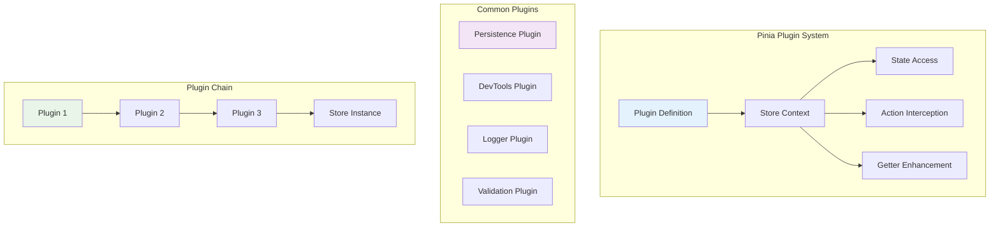
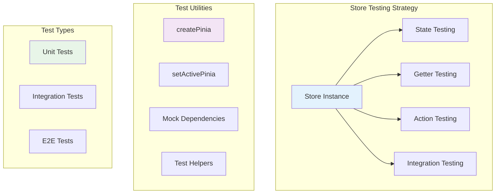
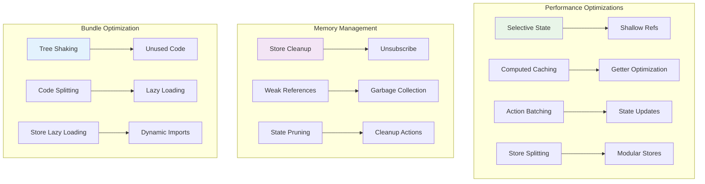

# Pinia State Management in Vue 3 🍍

## Pinia Architecture Overview

This diagram shows how Pinia manages state in Vue 3 applications with a clean, modular approach.

```mermaid
graph TB
    subgraph "Pinia Store Structure"
        A[Store Definition] --> B[State]
        A --> C[Getters]
        A --> D[Actions]
        A --> E[Plugins]
    end

    subgraph "Component Integration"
        F[Component A] --> G[useStore()]
        H[Component B] --> G
        I[Component C] --> G
        G --> J[Store Instance]
    end

    subgraph "State Flow"
        J --> K[Reactive State]
        K --> L[Computed Getters]
        L --> M[UI Updates]
        M --> N[User Actions]
        N --> O[Action Dispatch]
        O --> J
    end

    subgraph "DevTools Integration"
        P[Vue DevTools] --> Q[State Inspector]
        P --> R[Action Logger]
        P --> S[Time Travel]
    end

    style A fill:#e3f2fd
    style G fill:#f3e5f5
    style J fill:#e8f5e8
    style P fill:#fff3e0
```

## Store Definition Patterns

### Composition API Store



### Store Implementation Examples

```typescript
// stores/user.ts - Composition API
import { defineStore } from 'pinia'
import { ref, computed } from 'vue'

export const useUserStore = defineStore('user', () => {
  // State
  const users = ref<User[]>([])
  const currentUser = ref<User | null>(null)
  const loading = ref(false)
  const error = ref<string | null>(null)

  // Getters
  const isAuthenticated = computed(() => currentUser.value !== null)
  const userCount = computed(() => users.value.length)
  const activeUsers = computed(() =>
    users.value.filter(user => user.isActive)
  )

  // Actions
  const fetchUsers = async () => {
    loading.value = true
    error.value = null

    try {
      const response = await fetch('/api/users')
      if (!response.ok) throw new Error('Failed to fetch users')
      users.value = await response.json()
    } catch (err) {
      error.value = err instanceof Error ? err.message : 'Unknown error'
    } finally {
      loading.value = false
    }
  }

  const login = async (credentials: LoginCredentials) => {
    loading.value = true
    error.value = null

    try {
      const response = await fetch('/api/login', {
        method: 'POST',
        headers: { 'Content-Type': 'application/json' },
        body: JSON.stringify(credentials)
      })

      if (!response.ok) throw new Error('Login failed')
      currentUser.value = await response.json()
    } catch (err) {
      error.value = err instanceof Error ? err.message : 'Login failed'
      throw err
    } finally {
      loading.value = false
    }
  }

  const logout = () => {
    currentUser.value = null
    users.value = []
  }

  const updateUser = (id: string, updates: Partial<User>) => {
    const userIndex = users.value.findIndex(user => user.id === id)
    if (userIndex !== -1) {
      users.value[userIndex] = { ...users.value[userIndex], ...updates }
    }
  }

  return {
    // State
    users,
    currentUser,
    loading,
    error,
    // Getters
    isAuthenticated,
    userCount,
    activeUsers,
    // Actions
    fetchUsers,
    login,
    logout,
    updateUser
  }
})
```

```typescript
// stores/cart.ts - Options API
import { defineStore } from 'pinia'

export const useCartStore = defineStore('cart', {
  state: () => ({
    items: [] as CartItem[],
    total: 0,
    discount: 0
  }),

  getters: {
    itemCount: (state) => state.items.length,
    subtotal: (state) => state.items.reduce((sum, item) => sum + item.price * item.quantity, 0),
    finalTotal: (state) => {
      const subtotal = state.items.reduce((sum, item) => sum + item.price * item.quantity, 0)
      return subtotal - state.discount
    },
    isInCart: (state) => (productId: string) =>
      state.items.some(item => item.productId === productId)
  },

  actions: {
    addItem(product: Product, quantity: number = 1) {
      const existingItem = this.items.find(item => item.productId === product.id)

      if (existingItem) {
        existingItem.quantity += quantity
      } else {
        this.items.push({
          id: Date.now().toString(),
          productId: product.id,
          name: product.name,
          price: product.price,
          quantity
        })
      }

      this.updateTotal()
    },

    removeItem(itemId: string) {
      const index = this.items.findIndex(item => item.id === itemId)
      if (index > -1) {
        this.items.splice(index, 1)
        this.updateTotal()
      }
    },

    updateQuantity(itemId: string, quantity: number) {
      const item = this.items.find(item => item.id === itemId)
      if (item) {
        item.quantity = Math.max(0, quantity)
        if (item.quantity === 0) {
          this.removeItem(itemId)
        } else {
          this.updateTotal()
        }
      }
    },

    applyDiscount(code: string) {
      // Simulate discount logic
      if (code === 'SAVE10') {
        this.discount = this.subtotal * 0.1
      }
    },

    clearCart() {
      this.items = []
      this.total = 0
      this.discount = 0
    },

    updateTotal() {
      this.total = this.subtotal
    }
  }
})
```

## Store Composition and Modularity

### Store Dependencies



### Cross-Store Communication

```typescript
// stores/auth.ts
import { defineStore } from 'pinia'
import { useUserStore } from './user'
import { useCartStore } from './cart'

export const useAuthStore = defineStore('auth', () => {
  const userStore = useUserStore()
  const cartStore = useCartStore()

  const isAuthenticated = computed(() => userStore.isAuthenticated)

  const login = async (credentials: LoginCredentials) => {
    await userStore.login(credentials)
    // Load user's cart after login
    await cartStore.loadUserCart(userStore.currentUser?.id)
  }

  const logout = () => {
    userStore.logout()
    cartStore.clearCart()
  }

  return {
    isAuthenticated,
    login,
    logout
  }
})
```

## Store Plugins and Middleware

### Plugin Architecture



### Custom Plugin Example

```typescript
// plugins/persistence.ts
import { PiniaPluginContext } from 'pinia'

export function createPersistedState(options: {
  key?: string
  paths?: string[]
  storage?: Storage
}) {
  return ({ store }: PiniaPluginContext) => {
    const { key = store.$id, paths = [], storage = localStorage } = options

    // Load state from storage
    const stored = storage.getItem(key)
    if (stored) {
      const parsed = JSON.parse(stored)
      if (paths.length > 0) {
        // Only restore specific paths
        paths.forEach(path => {
          const value = getNestedValue(parsed, path)
          if (value !== undefined) {
            setNestedValue(store.$state, path, value)
          }
        })
      } else {
        // Restore entire state
        store.$patch(parsed)
      }
    }

    // Save state to storage on changes
    store.$subscribe((mutation, state) => {
      const stateToSave = paths.length > 0
        ? paths.reduce((acc, path) => {
            setNestedValue(acc, path, getNestedValue(state, path))
            return acc
          }, {})
        : state

      storage.setItem(key, JSON.stringify(stateToSave))
    })
  }
}

// Helper functions
function getNestedValue(obj: any, path: string) {
  return path.split('.').reduce((current, key) => current?.[key], obj)
}

function setNestedValue(obj: any, path: string, value: any) {
  const keys = path.split('.')
  const lastKey = keys.pop()!
  const target = keys.reduce((current, key) => {
    if (!(key in current)) current[key] = {}
    return current[key]
  }, obj)
  target[lastKey] = value
}
```

```typescript
// plugins/logger.ts
import { PiniaPluginContext } from 'pinia'

export function createLoggerPlugin() {
  return ({ store }: PiniaPluginContext) => {
    // Log state changes
    store.$subscribe((mutation, state) => {
      console.log(`[${store.$id}] State changed:`, {
        type: mutation.type,
        payload: mutation.payload,
        state: state
      })
    })

    // Log action calls
    const originalActions = { ...store }
    Object.keys(store).forEach(key => {
      if (typeof store[key] === 'function' && key !== '$id') {
        const originalAction = store[key]
        store[key] = function(...args: any[]) {
          console.log(`[${store.$id}] Action called: ${key}`, args)
          const result = originalAction.apply(this, args)

          // Handle async actions
          if (result instanceof Promise) {
            return result
              .then(res => {
                console.log(`[${store.$id}] Action completed: ${key}`, res)
                return res
              })
              .catch(err => {
                console.error(`[${store.$id}] Action failed: ${key}`, err)
                throw err
              })
          }

          console.log(`[${store.$id}] Action completed: ${key}`, result)
          return result
        }
      }
    })
  }
}
```

## Store Testing Patterns

### Unit Testing Stores



### Testing Implementation

```typescript
// tests/stores/user.test.ts
import { describe, it, expect, beforeEach, vi } from 'vitest'
import { setActivePinia, createPinia } from 'pinia'
import { useUserStore } from '@/stores/user'

// Mock fetch
global.fetch = vi.fn()

describe('User Store', () => {
  beforeEach(() => {
    setActivePinia(createPinia())
    vi.clearAllMocks()
  })

  describe('State', () => {
    it('should have initial state', () => {
      const store = useUserStore()

      expect(store.users).toEqual([])
      expect(store.currentUser).toBeNull()
      expect(store.loading).toBe(false)
      expect(store.error).toBeNull()
    })
  })

  describe('Getters', () => {
    it('should compute isAuthenticated correctly', () => {
      const store = useUserStore()

      expect(store.isAuthenticated).toBe(false)

      store.currentUser = { id: '1', name: 'John', email: 'john@example.com' }
      expect(store.isAuthenticated).toBe(true)
    })

    it('should compute userCount correctly', () => {
      const store = useUserStore()

      expect(store.userCount).toBe(0)

      store.users = [
        { id: '1', name: 'John', email: 'john@example.com' },
        { id: '2', name: 'Jane', email: 'jane@example.com' }
      ]
      expect(store.userCount).toBe(2)
    })
  })

  describe('Actions', () => {
    it('should fetch users successfully', async () => {
      const mockUsers = [
        { id: '1', name: 'John', email: 'john@example.com' },
        { id: '2', name: 'Jane', email: 'jane@example.com' }
      ]

      ;(fetch as any).mockResolvedValueOnce({
        ok: true,
        json: () => Promise.resolve(mockUsers)
      })

      const store = useUserStore()
      await store.fetchUsers()

      expect(store.users).toEqual(mockUsers)
      expect(store.loading).toBe(false)
      expect(store.error).toBeNull()
    })

    it('should handle fetch users error', async () => {
      ;(fetch as any).mockRejectedValueOnce(new Error('Network error'))

      const store = useUserStore()
      await store.fetchUsers()

      expect(store.users).toEqual([])
      expect(store.loading).toBe(false)
      expect(store.error).toBe('Network error')
    })

    it('should login successfully', async () => {
      const mockUser = { id: '1', name: 'John', email: 'john@example.com' }
      const credentials = { email: 'john@example.com', password: 'password' }

      ;(fetch as any).mockResolvedValueOnce({
        ok: true,
        json: () => Promise.resolve(mockUser)
      })

      const store = useUserStore()
      await store.login(credentials)

      expect(store.currentUser).toEqual(mockUser)
      expect(store.loading).toBe(false)
      expect(store.error).toBeNull()
    })

    it('should logout correctly', () => {
      const store = useUserStore()
      store.currentUser = { id: '1', name: 'John', email: 'john@example.com' }
      store.users = [{ id: '1', name: 'John', email: 'john@example.com' }]

      store.logout()

      expect(store.currentUser).toBeNull()
      expect(store.users).toEqual([])
    })
  })
})
```

## Performance Optimization

### Store Optimization Patterns



### Optimization Examples

```typescript
// stores/optimized.ts
import { defineStore } from 'pinia'
import { ref, computed, shallowRef } from 'vue'

export const useOptimizedStore = defineStore('optimized', () => {
  // Use shallowRef for large objects that don't need deep reactivity
  const largeDataSet = shallowRef<LargeData[]>([])

  // Use computed for expensive calculations with caching
  const expensiveCalculation = computed(() => {
    return largeDataSet.value.reduce((acc, item) => {
      // Expensive computation here
      return acc + item.value * Math.random()
    }, 0)
  })

  // Batch state updates
  const batchUpdate = (updates: Partial<State>[]) => {
    // Use $patch for batch updates
    store.$patch(state => {
      updates.forEach(update => {
        Object.assign(state, update)
      })
    })
  }

  // Cleanup function
  const cleanup = () => {
    largeDataSet.value = []
  }

  return {
    largeDataSet,
    expensiveCalculation,
    batchUpdate,
    cleanup
  }
})
```

---

**Next Steps**: Learn about [Vue Router & Navigation](./vue-router-navigation.md) to understand routing and navigation patterns in Vue 3 applications.
