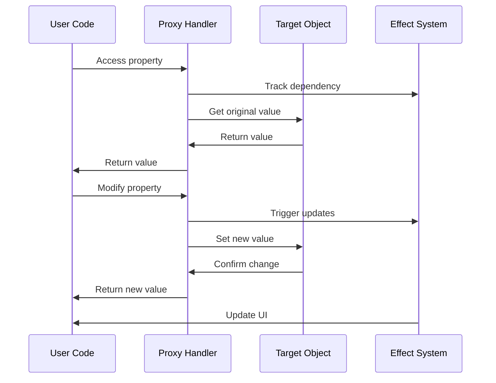
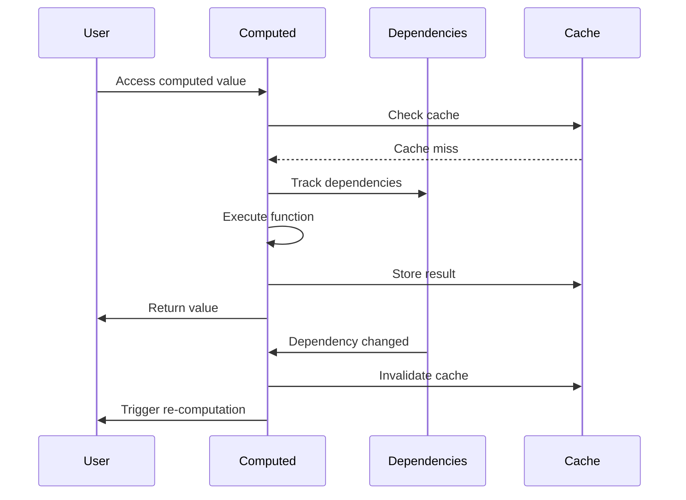

# Vue 3 Reactivity System ⚡

## Reactivity System Overview

This diagram illustrates how Vue 3's reactivity system works under the hood using Proxy-based observation.

```mermaid
graph TB
    subgraph "Reactive Data Creation"
        A[ref(primitive)] --> B[Reactive Reference]
        C[reactive(object)] --> D[Reactive Object]
        E[computed(derived)] --> F[Computed Reference]
    end

    subgraph "Proxy System"
        B --> G[Proxy Handler]
        D --> G
        F --> G
        G --> H[Getter Tracker]
        G --> I[Setter Trigger]
    end

    subgraph "Effect System"
        H --> J[Effect Function]
        J --> K[Dependency Collection]
        I --> L[Effect Re-execution]
        L --> M[Template Re-render]
    end

    subgraph "Template Compilation"
        M --> N[Virtual DOM Diff]
        N --> O[DOM Updates]
    end

    style A fill:#e3f2fd
    style G fill:#f3e5f5
    style J fill:#e8f5e8
    style N fill:#fff3e0
```

## Reactive Data Types

### ref() vs reactive() Comparison

```mermaid
graph LR
    subgraph "ref() - Primitive Values"
        A[ref(0)] --> B[Reactive Reference]
        C[ref('hello')] --> B
        D[ref(true)] --> B
        E[ref(null)] --> B
    end

    subgraph "reactive() - Objects"
        F[reactive({})] --> G[Reactive Object]
        H[reactive([])] --> G
        I[reactive(Map)] --> G
    end

    subgraph "Access Patterns"
        B --> J[.value property]
        G --> K[Direct property access]
    end

    subgraph "Use Cases"
        J --> L[Simple values]
        J --> M[Template refs]
        K --> N[Complex objects]
        K --> O[Form data]
    end

    style A fill:#e3f2fd
    style F fill:#f3e5f5
    style J fill:#e8f5e8
    style K fill:#fff3e0
```

## Proxy-Based Reactivity Deep Dive

### How Proxy Works



### Proxy Handler Implementation

```mermaid
graph TD
    subgraph "Proxy Handler"
        A[get() trap] --> B[Track Dependencies]
        C[set() trap] --> D[Trigger Updates]
        E[has() trap] --> F[Track 'in' operator]
        G[deleteProperty() trap] --> H[Track deletions]
    end

    subgraph "Dependency Tracking"
        B --> I[Active Effect]
        B --> J[Property Key]
        B --> K[Target Object]
    end

    subgraph "Update Triggering"
        D --> L[Find Dependencies]
        D --> M[Re-run Effects]
        D --> N[Update UI]
    end

    style A fill:#e3f2fd
    style C fill:#f3e5f5
    style I fill:#e8f5e8
    style L fill:#fff3e0
```

## Effect System Architecture

### Effect Collection and Execution

```mermaid
graph TB
    subgraph "Effect Creation"
        A[effect() function] --> B[Effect Object]
        B --> C[Effect Function]
        B --> D[Dependencies Set]
    end

    subgraph "Dependency Collection"
        C --> E[Track Dependencies]
        E --> F[Add to Dep Map]
        F --> G[Store Effect Reference]
    end

    subgraph "Update Propagation"
        H[Data Change] --> I[Find Dependencies]
        I --> J[Queue Effects]
        J --> K[Execute Effects]
        K --> L[Update UI]
    end

    style A fill:#e3f2fd
    style E fill:#f3e5f5
    style H fill:#e8f5e8
    style L fill:#fff3e0
```

## Computed Properties Deep Dive

### Computed vs Methods vs Watch

```mermaid
graph LR
    subgraph "Computed Properties"
        A[computed()] --> B[Cached Results]
        B --> C[Reactive Dependencies]
        C --> D[Auto Re-computation]
    end

    subgraph "Methods"
        E[methods] --> F[Always Executed]
        F --> G[No Caching]
        G --> H[Manual Invocation]
    end

    subgraph "Watchers"
        I[watch()] --> J[Side Effects]
        J --> K[Manual Dependencies]
        K --> L[Explicit Triggers]
    end

    subgraph "Use Cases"
        B --> M[Derived Data]
        F --> N[Event Handlers]
        J --> O[API Calls]
    end

    style A fill:#e8f5e8
    style E fill:#fff3e0
    style I fill:#f3e5f5
```

### Computed Property Lifecycle



## Watchers and Side Effects

### Watch Types and Patterns

```mermaid
graph TD
    subgraph "watch() - Single Source"
        A[watch(source, callback)] --> B[Immediate Execution]
        A --> C[Deep Watching]
        A --> D[Flush Timing]
    end

    subgraph "watchEffect() - Auto Tracking"
        E[watchEffect(callback)] --> F[Auto Dependency Tracking]
        E --> G[Immediate Execution]
        E --> H[Cleanup Function]
    end

    subgraph "watchPostEffect() - After DOM"
        I[watchPostEffect(callback)] --> J[After DOM Updates]
        I --> K[DOM Manipulation Safe]
    end

    subgraph "Use Cases"
        B --> L[API Calls]
        F --> M[Logging]
        J --> N[Focus Management]
    end

    style A fill:#e3f2fd
    style E fill:#f3e5f5
    style I fill:#e8f5e8
```

## Reactivity Best Practices

### Do's and Don'ts

```mermaid
graph LR
    subgraph "✅ Do"
        A[Use ref() for primitives]
        B[Use reactive() for objects]
        C[Use computed() for derived data]
        D[Clean up watchers]
        E[Use shallowRef() for large objects]
    end

    subgraph "❌ Don't"
        F[Don't destructure reactive objects]
        G[Don't mutate props directly]
        H[Don't create reactive in computed]
        I[Don't forget cleanup functions]
        J[Don't use reactive() for primitives]
    end

    style A fill:#e8f5e8
    style F fill:#ffebee
```

## Performance Considerations

### Reactivity Performance Patterns

```mermaid
graph TB
    subgraph "Performance Optimizations"
        A[shallowRef()] --> B[Large Object Optimization]
        C[markRaw()] --> D[Skip Reactivity]
        E[readonly()] --> F[Prevent Mutations]
        G[toRaw()] --> H[Access Original Object]
    end

    subgraph "Memory Management"
        I[stop()] --> J[Stop Reactivity]
        K[cleanup] --> L[Remove Dependencies]
        M[unref()] --> N[Get Raw Value]
    end

    subgraph "Bundle Size"
        O[Tree Shaking] --> P[Remove Unused Code]
        Q[Lazy Loading] --> R[Load on Demand]
    end

    style A fill:#e3f2fd
    style I fill:#f3e5f5
    style O fill:#e8f5e8
```

## Common Reactivity Patterns

### Form Handling Pattern

```vue
<script setup lang="ts">
import { reactive, computed } from 'vue'

// Form data
const form = reactive({
  name: '',
  email: '',
  age: 0
})

// Form validation
const errors = reactive({
  name: '',
  email: '',
  age: ''
})

// Computed validation
const isFormValid = computed(() => {
  return !errors.name && !errors.email && !errors.age
})

// Form submission
const submitForm = () => {
  if (isFormValid.value) {
    console.log('Form submitted:', form)
  }
}
</script>
```

### API Data Pattern

```vue
<script setup lang="ts">
import { ref, computed, watchEffect } from 'vue'

// API state
const data = ref(null)
const loading = ref(false)
const error = ref(null)

// Computed derived state
const hasData = computed(() => data.value !== null)
const isEmpty = computed(() => data.value?.length === 0)

// Auto-fetch data
watchEffect(async () => {
  loading.value = true
  error.value = null

  try {
    const response = await fetch('/api/data')
    data.value = await response.json()
  } catch (err) {
    error.value = err.message
  } finally {
    loading.value = false
  }
})
</script>
```

## Debugging Reactivity

### Common Issues and Solutions

```mermaid
graph TD
    A[Reactivity Not Working] --> B{Identify Issue}

    B --> C[Data Not Reactive]
    B --> D[Updates Not Triggering]
    B --> E[Infinite Loops]
    B --> F[Memory Leaks]

    C --> G[Use ref() or reactive()]
    C --> H[Check Proxy Support]

    D --> I[Check Dependencies]
    D --> J[Verify Effect Setup]

    E --> K[Check Circular Dependencies]
    E --> L[Use nextTick()]

    F --> M[Clean Up Watchers]
    F --> N[Use stop()]

    style A fill:#ffebee
    style G fill:#e8f5e8
    style I fill:#fff3e0
    style K fill:#f3e5f5
    style M fill:#e0f2f1
```

---

**Next Steps**: Learn about [Data Flow Patterns](./data-flow-patterns.md) to understand how data flows between components in Vue 3 applications.
