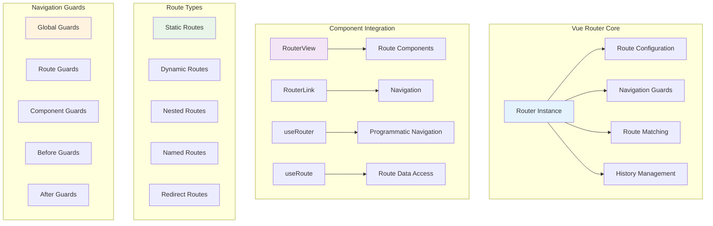
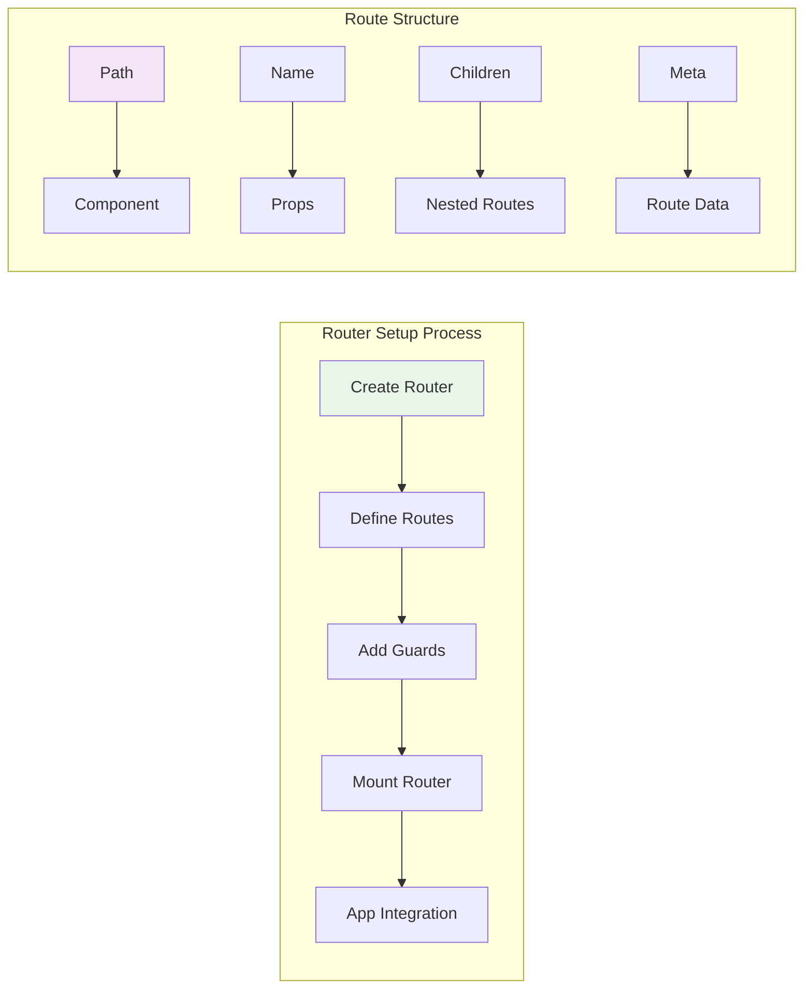
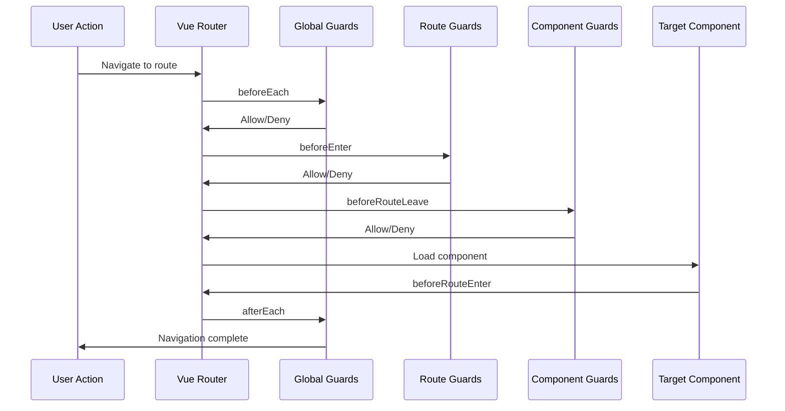
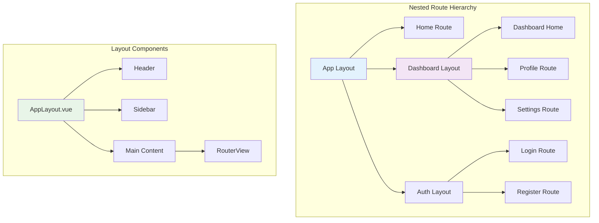

# Vue Router & Navigation in Vue 3 🧭

## Vue Router Architecture

This diagram shows how Vue Router handles navigation and routing in Vue 3 applications.



## Router Configuration

### Basic Router Setup



### Router Implementation

```typescript
// router/index.ts
import { createRouter, createWebHistory } from 'vue-router'
import type { RouteRecordRaw } from 'vue-router'

const routes: RouteRecordRaw[] = [
  {
    path: '/',
    name: 'Home',
    component: () => import('@/views/HomeView.vue'),
    meta: { requiresAuth: false, title: 'Home' }
  },
  {
    path: '/about',
    name: 'About',
    component: () => import('@/views/AboutView.vue'),
    meta: { requiresAuth: false, title: 'About' }
  },
  {
    path: '/dashboard',
    name: 'Dashboard',
    component: () => import('@/layouts/DashboardLayout.vue'),
    meta: { requiresAuth: true, title: 'Dashboard' },
    children: [
      {
        path: '',
        name: 'DashboardHome',
        component: () => import('@/views/dashboard/DashboardHome.vue'),
        meta: { title: 'Dashboard Home' }
      },
      {
        path: 'profile',
        name: 'Profile',
        component: () => import('@/views/dashboard/Profile.vue'),
        meta: { title: 'Profile' }
      },
      {
        path: 'settings',
        name: 'Settings',
        component: () => import('@/views/dashboard/Settings.vue'),
        meta: { title: 'Settings' }
      }
    ]
  },
  {
    path: '/user/:id',
    name: 'UserProfile',
    component: () => import('@/views/UserProfile.vue'),
    props: true,
    meta: { requiresAuth: true, title: 'User Profile' }
  },
  {
    path: '/products/:category/:id',
    name: 'ProductDetail',
    component: () => import('@/views/ProductDetail.vue'),
    props: route => ({
      category: route.params.category,
      id: route.params.id,
      query: route.query
    }),
    meta: { requiresAuth: false, title: 'Product Detail' }
  },
  {
    path: '/login',
    name: 'Login',
    component: () => import('@/views/Login.vue'),
    meta: { requiresAuth: false, title: 'Login' }
  },
  {
    path: '/:pathMatch(.*)*',
    name: 'NotFound',
    component: () => import('@/views/NotFound.vue'),
    meta: { title: 'Page Not Found' }
  }
]

const router = createRouter({
  history: createWebHistory(import.meta.env.BASE_URL),
  routes,
  scrollBehavior(to, from, savedPosition) {
    if (savedPosition) {
      return savedPosition
    } else if (to.hash) {
      return {
        el: to.hash,
        behavior: 'smooth'
      }
    } else {
      return { top: 0 }
    }
  }
})

export default router
```

## Navigation Guards

### Guard Types and Execution Order



### Guard Implementation

```typescript
// router/guards.ts
import type { NavigationGuardNext, RouteLocationNormalized } from 'vue-router'
import { useAuthStore } from '@/stores/auth'

// Global before guard
router.beforeEach(async (to, from, next) => {
  const authStore = useAuthStore()
  
  // Set page title
  if (to.meta.title) {
    document.title = `${to.meta.title} - My App`
  }
  
  // Check authentication
  if (to.meta.requiresAuth && !authStore.isAuthenticated) {
    next({ name: 'Login', query: { redirect: to.fullPath } })
    return
  }
  
  // Redirect authenticated users away from login
  if (to.name === 'Login' && authStore.isAuthenticated) {
    next({ name: 'Dashboard' })
    return
  }
  
  // Check permissions
  if (to.meta.permissions) {
    const hasPermission = await authStore.checkPermissions(to.meta.permissions)
    if (!hasPermission) {
      next({ name: 'Unauthorized' })
      return
    }
  }
  
  next()
})

// Global after guard
router.afterEach((to, from, failure) => {
  if (failure) {
    console.error('Navigation failed:', failure)
  } else {
    // Track page views
    if (typeof gtag !== 'undefined') {
      gtag('config', 'GA_MEASUREMENT_ID', {
        page_path: to.path
      })
    }
  }
})

// Route-specific guard
const dashboardRoute = {
  path: '/dashboard',
  beforeEnter: (to, from, next) => {
    const authStore = useAuthStore()
    
    if (!authStore.isAuthenticated) {
      next({ name: 'Login' })
    } else if (!authStore.hasRole('user')) {
      next({ name: 'Unauthorized' })
    } else {
      next()
    }
  }
}
```

### Component Guards

```vue
<!-- Component with guards -->
<template>
  <div>
    <h1>User Profile</h1>
    <p>User ID: {{ $route.params.id }}</p>
    <button @click="saveAndLeave">Save and Leave</button>
  </div>
</template>

<script setup lang="ts">
import { onBeforeRouteLeave, onBeforeRouteUpdate } from 'vue-router'
import { ref } from 'vue'

const hasUnsavedChanges = ref(false)
const isSaving = ref(false)

// Before leaving the route
onBeforeRouteLeave((to, from, next) => {
  if (hasUnsavedChanges.value && !isSaving.value) {
    const answer = window.confirm(
      'You have unsaved changes. Are you sure you want to leave?'
    )
    if (answer) {
      next()
    } else {
      next(false)
    }
  } else {
    next()
  }
})

// Before updating the route (same component, different params)
onBeforeRouteUpdate(async (to, from, next) => {
  // Reset form when user ID changes
  if (to.params.id !== from.params.id) {
    await loadUser(to.params.id as string)
    hasUnsavedChanges.value = false
  }
  next()
})

const saveAndLeave = async () => {
  isSaving.value = true
  try {
    await saveUser()
    hasUnsavedChanges.value = false
    // Navigate away after saving
    await router.push('/dashboard')
  } catch (error) {
    console.error('Save failed:', error)
  } finally {
    isSaving.value = false
  }
}
</script>
```

## Dynamic Routes and Route Matching

### Dynamic Route Patterns

```mermaid
graph TB
    subgraph "Dynamic Route Types"
        A[Param Routes] --> B[/user/:id]
        C[Optional Params] --> D[/user/:id?]
        E[Multiple Params] --> F[/user/:id/post/:postId]
        G[Wildcard Routes] --> H[/user/*]
        I[Regex Routes] --> J[/user/:id(\\d+)]
    end
    
    subgraph "Route Matching"
        K[Exact Match] --> L[Static Routes]
        M[Param Match] --> N[Dynamic Routes]
        O[Wildcard Match] --> P[Catch-all Routes]
        Q[Regex Match] --> R[Pattern Routes]
    end
    
    style A fill:#e8f5e8
    style K fill:#f3e5f5
```

### Dynamic Route Implementation

```vue
<!-- UserProfile.vue -->
<template>
  <div v-if="loading">Loading...</div>
  <div v-else-if="error">{{ error }}</div>
  <div v-else>
    <h1>{{ user.name }}</h1>
    <p>Email: {{ user.email }}</p>
    <p>Member since: {{ formatDate(user.createdAt) }}</p>
    
    <!-- Nested routes -->
    <nav>
      <router-link :to="{ name: 'UserPosts', params: { id: user.id } }">
        Posts
      </router-link>
      <router-link :to="{ name: 'UserComments', params: { id: user.id } }">
        Comments
      </router-link>
    </nav>
    
    <router-view />
  </div>
</template>

<script setup lang="ts">
import { ref, onMounted, watch } from 'vue'
import { useRoute, useRouter } from 'vue-router'

interface User {
  id: string
  name: string
  email: string
  createdAt: string
}

const route = useRoute()
const router = useRouter()

const user = ref<User | null>(null)
const loading = ref(false)
const error = ref<string | null>(null)

const loadUser = async (id: string) => {
  loading.value = true
  error.value = null
  
  try {
    const response = await fetch(`/api/users/${id}`)
    if (!response.ok) {
      throw new Error('User not found')
    }
    user.value = await response.json()
  } catch (err) {
    error.value = err instanceof Error ? err.message : 'Failed to load user'
  } finally {
    loading.value = false
  }
}

// Watch for route changes
watch(() => route.params.id, (newId) => {
  if (newId && typeof newId === 'string') {
    loadUser(newId)
  }
}, { immediate: true })

const formatDate = (dateString: string) => {
  return new Date(dateString).toLocaleDateString()
}
</script>
```

## Nested Routes and Layouts

### Nested Route Structure



### Layout Implementation

```vue
<!-- layouts/AppLayout.vue -->
<template>
  <div class="app-layout">
    <AppHeader />
    <div class="main-content">
      <AppSidebar v-if="showSidebar" />
      <main class="content">
        <router-view />
      </main>
    </div>
    <AppFooter />
  </div>
</template>

<script setup lang="ts">
import { computed } from 'vue'
import { useRoute } from 'vue-router'
import AppHeader from '@/components/AppHeader.vue'
import AppSidebar from '@/components/AppSidebar.vue'
import AppFooter from '@/components/AppFooter.vue'

const route = useRoute()

const showSidebar = computed(() => {
  return route.meta.showSidebar !== false
})
</script>

<style scoped>
.app-layout {
  display: flex;
  flex-direction: column;
  min-height: 100vh;
}

.main-content {
  display: flex;
  flex: 1;
}

.content {
  flex: 1;
  padding: 1rem;
}
</style>
```

```vue
<!-- layouts/DashboardLayout.vue -->
<template>
  <div class="dashboard-layout">
    <DashboardHeader />
    <div class="dashboard-content">
      <DashboardSidebar />
      <main class="dashboard-main">
        <Breadcrumb />
        <router-view />
      </main>
    </div>
  </div>
</template>

<script setup lang="ts">
import DashboardHeader from '@/components/DashboardHeader.vue'
import DashboardSidebar from '@/components/DashboardSidebar.vue'
import Breadcrumb from '@/components/Breadcrumb.vue'
</script>

<style scoped>
.dashboard-layout {
  display: flex;
  flex-direction: column;
  height: 100vh;
}

.dashboard-content {
  display: flex;
  flex: 1;
  overflow: hidden;
}

.dashboard-main {
  flex: 1;
  overflow-y: auto;
  padding: 1rem;
}
</style>
```

## Programmatic Navigation

### Navigation Methods

```mermaid
graph TB
    subgraph "Navigation Methods"
        A[router.push] --> B[Add to History]
        C[router.replace] --> D[Replace History]
        E[router.go] --> F[History Navigation]
        G[router.back] --> H[Go Back]
        I[router.forward] --> J[Go Forward]
    end
    
    subgraph "Navigation Options"
        K[String Path] --> L['/user/123']
        M[Named Route] --> N[{ name: 'User', params: { id: 123 } }]
        O[Query Params] --> P[{ path: '/search', query: { q: 'vue' } }]
        Q[Hash Navigation] --> R[{ path: '/about', hash: '#contact' }]
    end
    
    style A fill:#e8f5e8
    style K fill:#f3e5f5
```

### Navigation Implementation

```vue
<!-- NavigationExample.vue -->
<template>
  <div>
    <h2>Navigation Examples</h2>
    
    <!-- String navigation -->
    <button @click="navigateToString">Go to Home</button>
    
    <!-- Named route navigation -->
    <button @click="navigateToUser">Go to User Profile</button>
    
    <!-- Navigation with query params -->
    <button @click="searchProducts">Search Products</button>
    
    <!-- Navigation with state -->
    <button @click="navigateWithState">Navigate with State</button>
    
    <!-- Replace navigation -->
    <button @click="replaceRoute">Replace Current Route</button>
    
    <!-- History navigation -->
    <button @click="goBack">Go Back</button>
    <button @click="goForward">Go Forward</button>
    
    <!-- Conditional navigation -->
    <button @click="conditionalNavigation">Conditional Navigation</button>
  </div>
</template>

<script setup lang="ts">
import { useRouter, useRoute } from 'vue-router'
import { useAuthStore } from '@/stores/auth'

const router = useRouter()
const route = useRoute()
const authStore = useAuthStore()

// String navigation
const navigateToString = () => {
  router.push('/')
}

// Named route navigation
const navigateToUser = () => {
  router.push({
    name: 'UserProfile',
    params: { id: '123' }
  })
}

// Navigation with query params
const searchProducts = () => {
  router.push({
    name: 'Products',
    query: {
      search: 'vue',
      category: 'books',
      page: 1
    }
  })
}

// Navigation with state
const navigateWithState = () => {
  router.push({
    name: 'Dashboard',
    state: {
      from: 'navigation-example',
      timestamp: Date.now()
    }
  })
}

// Replace navigation (no history entry)
const replaceRoute = () => {
  router.replace({
    name: 'Login'
  })
}

// History navigation
const goBack = () => {
  router.go(-1)
}

const goForward = () => {
  router.go(1)
}

// Conditional navigation
const conditionalNavigation = async () => {
  if (authStore.isAuthenticated) {
    await router.push({ name: 'Dashboard' })
  } else {
    await router.push({ 
      name: 'Login',
      query: { redirect: route.fullPath }
    })
  }
}

// Navigation with guards
const navigateWithGuard = async () => {
  try {
    await router.push({ name: 'ProtectedRoute' })
    console.log('Navigation successful')
  } catch (error) {
    console.log('Navigation blocked:', error)
  }
}
</script>
```

## Route Meta and Transitions

### Route Meta Fields

```typescript
// router/meta.ts
declare module 'vue-router' {
  interface RouteMeta {
    requiresAuth?: boolean
    permissions?: string[]
    title?: string
    description?: string
    keywords?: string[]
    layout?: string
    showSidebar?: boolean
    showHeader?: boolean
    transition?: string
    keepAlive?: boolean
    scrollToTop?: boolean
  }
}

// Example route with meta
const routes = [
  {
    path: '/admin',
    name: 'Admin',
    component: () => import('@/views/Admin.vue'),
    meta: {
      requiresAuth: true,
      permissions: ['admin'],
      title: 'Admin Panel',
      description: 'Administrative dashboard',
      keywords: ['admin', 'dashboard', 'management'],
      layout: 'admin',
      showSidebar: true,
      showHeader: true,
      transition: 'slide-left',
      keepAlive: true,
      scrollToTop: true
    }
  }
]
```

### Route Transitions

```vue
<!-- App.vue -->
<template>
  <div id="app">
    <router-view v-slot="{ Component, route }">
      <transition
        :name="route.meta.transition || 'fade'"
        mode="out-in"
        appear
      >
        <component :is="Component" :key="route.path" />
      </transition>
    </router-view>
  </div>
</template>

<script setup lang="ts">
import { watch } from 'vue'
import { useRoute } from 'vue-router'

const route = useRoute()

// Update page title based on route meta
watch(route, (to) => {
  if (to.meta.title) {
    document.title = `${to.meta.title} - My App`
  }
  
  if (to.meta.description) {
    const metaDescription = document.querySelector('meta[name="description"]')
    if (metaDescription) {
      metaDescription.setAttribute('content', to.meta.description)
    }
  }
}, { immediate: true })
</script>

<style>
/* Fade transition */
.fade-enter-active,
.fade-leave-active {
  transition: opacity 0.3s ease;
}

.fade-enter-from,
.fade-leave-to {
  opacity: 0;
}

/* Slide transitions */
.slide-left-enter-active,
.slide-left-leave-active {
  transition: transform 0.3s ease;
}

.slide-left-enter-from {
  transform: translateX(100%);
}

.slide-left-leave-to {
  transform: translateX(-100%);
}

.slide-right-enter-active,
.slide-right-leave-active {
  transition: transform 0.3s ease;
}

.slide-right-enter-from {
  transform: translateX(-100%);
}

.slide-right-leave-to {
  transform: translateX(100%);
}
</style>
```

---

**Next Steps**: Learn about [API Integration & Data Fetching](./api-integration-data-fetching.md) to understand how to integrate with backend APIs in Vue 3 applications.
