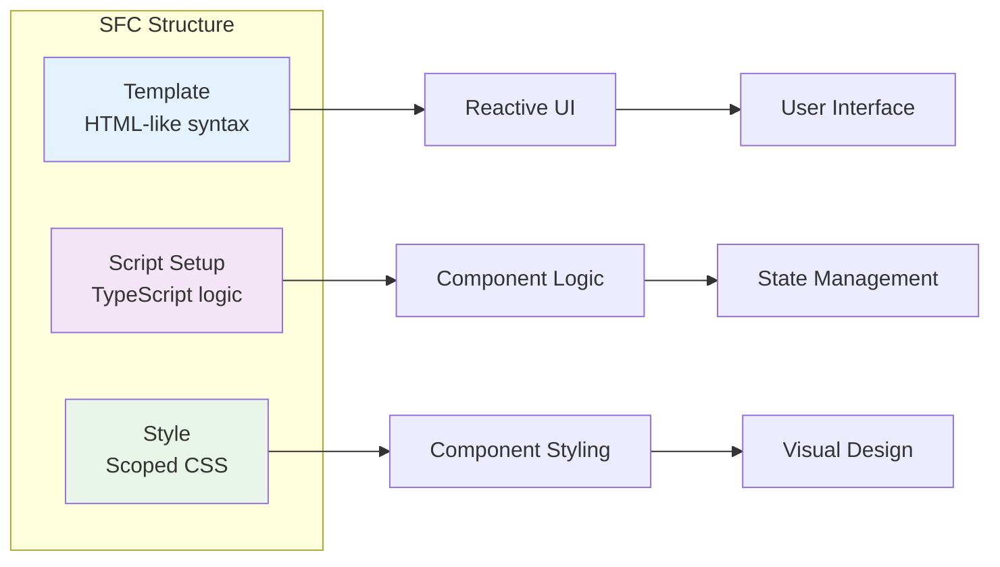
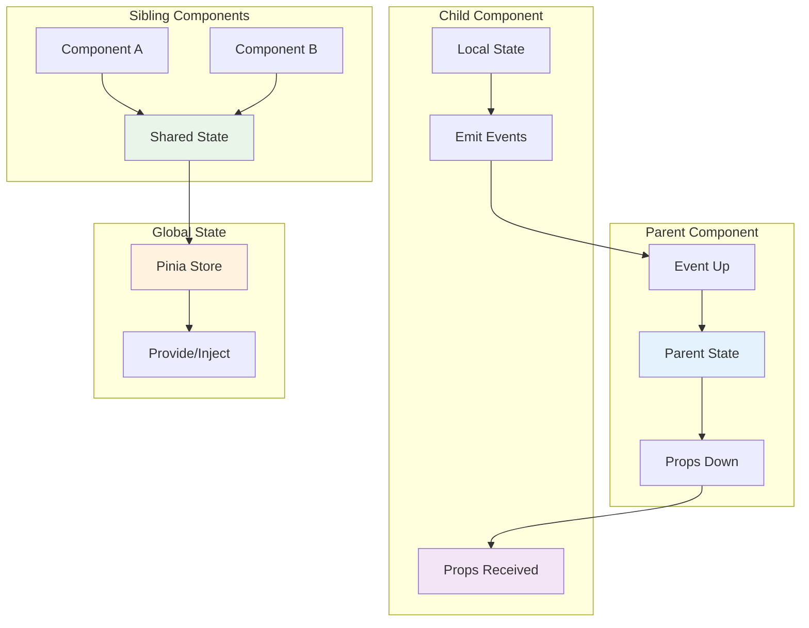
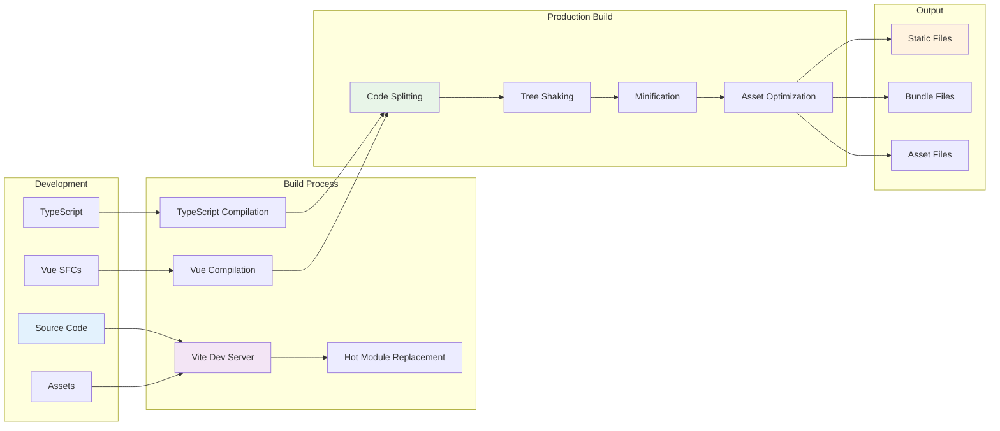
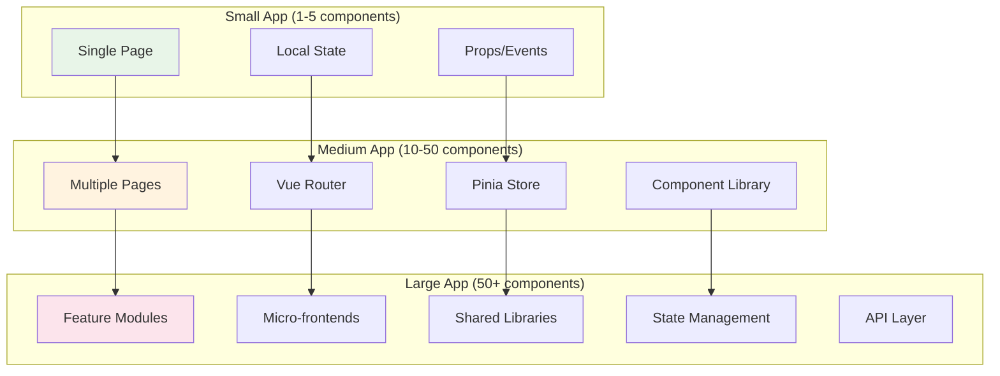

# Vue 3 Architecture 🏗️

## Vue 3 System Architecture Overview

This diagram illustrates the core architecture of Vue 3 and how its different parts work together.

```mermaid
graph TB
    subgraph "Vue 3 Application"
        subgraph "Template Layer"
            A[Template Syntax]
            B[Directives]
            C[Event Handling]
        end

        subgraph "Component Layer"
            D[Single File Components]
            E[Composition API]
            F[Options API]
        end

        subgraph "Reactivity System"
            G[Proxy-based Reactivity]
            H[ref() & reactive()]
            I[Computed Properties]
            J[Watchers]
        end

        subgraph "State Management"
            K[Local State]
            L[Pinia Store]
            M[Provide/Inject]
        end

        subgraph "Lifecycle"
            N[onMounted]
            O[onUpdated]
            P[onUnmounted]
        end
    end

    subgraph "Build Tools"
        Q[Vite]
        R[TypeScript]
        S[ESLint/Prettier]
    end

    subgraph "Browser"
        T[DOM Manipulation]
        U[Event System]
        V[Virtual DOM]
    end

    A --> D
    B --> D
    C --> D
    D --> E
    D --> F
    E --> G
    F --> G
    G --> H
    G --> I
    G --> J
    H --> K
    I --> K
    J --> K
    K --> L
    L --> M
    E --> N
    E --> O
    E --> P
    D --> Q
    Q --> R
    Q --> S
    D --> T
    D --> U
    D --> V

    style A fill:#e3f2fd
    style D fill:#f3e5f5
    style G fill:#e8f5e8
    style K fill:#fff3e0
    style N fill:#fce4ec
    style Q fill:#e0f2f1
```

## Component Architecture Patterns

### Single File Component Structure



### Composition API vs Options API

```mermaid
graph TD
    subgraph "Composition API (Recommended)"
        A[setup() function]
        B[ref() & reactive()]
        C[computed()]
        D[watch()]
        E[Lifecycle Hooks]
    end

    subgraph "Options API (Legacy)"
        F[data()]
        G[computed]
        H[watch]
        I[methods]
        J[Lifecycle Hooks]
    end

    A --> K[Better TypeScript Support]
    A --> L[Better Code Organization]
    A --> M[Better Reusability]

    F --> N[Familiar to Vue 2 Users]
    F --> O[Easier for Beginners]

    style A fill:#e8f5e8
    style F fill:#fff3e0
```

## Data Flow Architecture

### Component Communication Patterns



## Reactivity System Deep Dive

### Vue 3 Reactivity Architecture

```mermaid
graph TB
    subgraph "Reactive Data"
        A[ref(primitive)]
        B[reactive(object)]
        C[computed(derived)]
    end

    subgraph "Proxy System"
        D[Proxy Handler]
        E[Getter Tracker]
        F[Setter Trigger]
    end

    subgraph "Effect System"
        G[Effect Function]
        H[Dependency Collection]
        I[Re-execution]
    end

    subgraph "Template Rendering"
        J[Template Compilation]
        K[Render Function]
        L[Virtual DOM]
    end

    A --> D
    B --> D
    C --> D
    D --> E
    D --> F
    E --> G
    F --> I
    G --> H
    H --> J
    J --> K
    K --> L

    style A fill:#e3f2fd
    style D fill:#f3e5f5
    style G fill:#e8f5e8
    style J fill:#fff3e0
```

## Build Process Architecture

### Development to Production Pipeline



## Application Architecture Patterns

### Small to Large Scale Applications



## Performance Architecture

### Optimization Strategies

```mermaid
graph TB
    subgraph "Bundle Optimization"
        A[Code Splitting]
        B[Tree Shaking]
        C[Lazy Loading]
        D[Dynamic Imports]
    end

    subgraph "Runtime Optimization"
        E[Virtual DOM]
        F[Diff Algorithm]
        G[Component Caching]
        H[Memoization]
    end

    subgraph "Memory Management"
        I[Garbage Collection]
        J[Memory Leaks Prevention]
        K[Event Cleanup]
        L[Component Unmounting]
    end

    A --> M[Smaller Bundles]
    B --> M
    C --> N[Faster Initial Load]
    D --> N

    E --> O[Efficient Updates]
    F --> O
    G --> P[Better Performance]
    H --> P

    I --> Q[Stable Memory Usage]
    J --> Q
    K --> R[Clean Application State]
    L --> R

    style A fill:#e3f2fd
    style E fill:#f3e5f5
    style I fill:#e8f5e8
```



## Key Architectural Principles

### 1. **Component-Based Architecture**
- Reusable, composable UI components
- Single responsibility principle
- Clear component boundaries

### 2. **Reactive Data Flow**
- Unidirectional data flow
- Predictable state changes
- Automatic UI updates

### 3. **Composition Over Inheritance**
- Mix and match functionality
- Better code reusability
- Easier testing and maintenance

### 4. **Progressive Enhancement**
- Start simple, add complexity gradually
- Framework can be adopted incrementally
- Works with existing projects

### 5. **Developer Experience**
- TypeScript support
- Hot module replacement
- Excellent tooling ecosystem

---

**Next Steps**: Learn about [Component Lifecycle](./component-lifecycle.md) to understand how Vue 3 manages component states throughout their lifetime.
