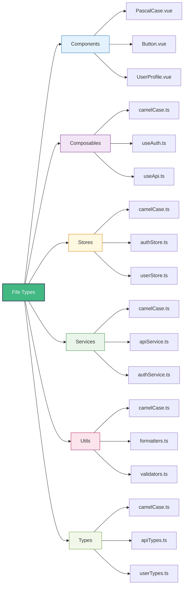
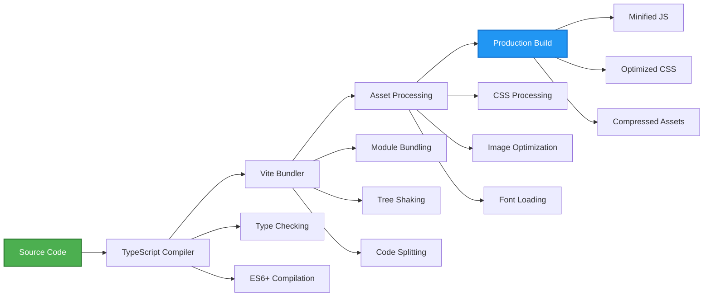
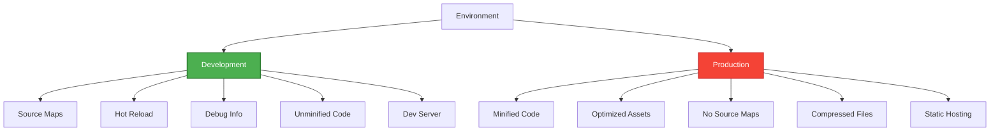

# Vue Project Structure 📁

## TypeScript Project Organization

This diagram shows the recommended project structure for Vue 3 applications with TypeScript, including folder organization, naming conventions, and best practices.

```mermaid
graph TD
    A[Vue Project Root] --> B[src/]
    A --> C[public/]
    A --> D[config/]
    A --> E[tests/]
    A --> F[.github/]
    A --> G[Documentation]

    B --> B1[components/]
    B --> B2[views/]
    B --> B3[composables/]
    B --> B4[stores/]
    B --> B5[services/]
    B --> B6[utils/]
    B --> B7[types/]
    B --> B8[assets/]
    B --> B9[styles/]
    B --> B10[App.vue]
    B --> B11[main.ts]
    B --> B12[router/]

    B1 --> B1a[ui/]
    B1 --> B1b[forms/]
    B1 --> B1c[layout/]
    B1 --> B1d[common/]

    B2 --> B2a[Home.vue]
    B2 --> B2b[About.vue]
    B2 --> B2c[Contact.vue]
    B2 --> B2d[auth/]
    B2 --> B2e[dashboard/]

    B3 --> B3a[useAuth.ts]
    B3 --> B3b[useApi.ts]
    B3 --> B3c[useLocalStorage.ts]
    B3 --> B3d[useValidation.ts]

    B4 --> B4a[auth.ts]
    B4 --> B4b[user.ts]
    B4 --> B4c[app.ts]

    B5 --> B5a[api.ts]
    B5 --> B5b[authService.ts]
    B5 --> B5c[userService.ts]

    B6 --> B6a[formatters.ts]
    B6 --> B6b[validators.ts]
    B6 --> B6c[constants.ts]
    B6 --> B6d[helpers.ts]

    B7 --> B7a[api.ts]
    B7 --> B7b[user.ts]
    B7 --> B7c[common.ts]

    B8 --> B8a[images/]
    B8 --> B8b[icons/]
    B8 --> B8c[fonts/]

    B9 --> B9a[main.css]
    B9 --> B9b[variables.css]
    B9 --> B9c[components.css]

    B12 --> B12a[index.ts]
    B12 --> B12b[guards.ts]
    B12 --> B12c[routes.ts]

    style A fill:#42b883,stroke:#35495e,stroke-width:3px,color:#fff
    style B fill:#e3f2fd,stroke:#1976d2,stroke-width:2px
    style B1 fill:#f3e5f5,stroke:#7b1fa2,stroke-width:2px
    style B2 fill:#fff8e1,stroke:#f57c00,stroke-width:2px
    style B3 fill:#e8f5e8,stroke:#388e3c,stroke-width:2px
    style B4 fill:#fce4ec,stroke:#c2185b,stroke-width:2px
```



## Component Organization

```mermaid
graph TD
    A[components/] --> B[ui/]
    A --> C[forms/]
    A --> D[layout/]
    A --> E[common/]

    B --> B1[Button.vue]
    B --> B2[Input.vue]
    B --> B3[Modal.vue]
    B --> B4[Card.vue]
    B --> B5[Loading.vue]

    C --> C1[LoginForm.vue]
    C --> C2[ContactForm.vue]
    C --> C3[SearchForm.vue]
    C --> C4[ValidationMixin.ts]

    D --> D1[Header.vue]
    D --> D2[Footer.vue]
    D --> D3[Sidebar.vue]
    D --> D4[Navigation.vue]

    E --> E1[UserCard.vue]
    E --> E2[ProductList.vue]
    E --> E3[DataTable.vue]
    E --> E4[Pagination.vue]

    style A fill:#42b883,stroke:#35495e,stroke-width:2px,color:#fff
    style B fill:#e3f2fd,stroke:#1976d2,stroke-width:1px
    style C fill:#f3e5f5,stroke:#7b1fa2,stroke-width:1px
    style D fill:#fff8e1,stroke:#f57c00,stroke-width:1px
    style E fill:#e8f5e8,stroke:#388e3c,stroke-width:1px
```



## File Naming Conventions



## Import/Export Patterns

```mermaid
graph TD
    A[Barrel Exports] --> B[index.ts files]
    B --> C[Component Exports]
    B --> D[Composable Exports]
    B --> E[Service Exports]
    B --> F[Type Exports]

    C --> C1[export { default as Button } from './Button.vue']
    C --> C2[export { default as Modal } from './Modal.vue']

    D --> D1[export { useAuth } from './useAuth'"]
    D --> D2[export { useApi } from './useApi'"]

    E --> E1[export { apiService } from './apiService'"]
    E --> E2[export { authService } from './authService'"]

    F --> F1[export type { User } from './user'"]
    F --> F2[export type { ApiResponse } from './api'"]

    G[Usage] --> H[import { Button, Modal } from '@/components'"]
    G --> I[import { useAuth, useApi } from '@/composables'"]
    G --> J[import { apiService } from '@/services'"]
    G --> K[import type { User } from '@/types'"]

    style A fill:#42b883,stroke:#35495e,stroke-width:2px,color:#fff
    style G fill:#ff9800,stroke:#f57c00,stroke-width:2px,color:#fff
```

## Build Process



## Development vs Production



## Configuration Files

```mermaid
graph TD
    A[Project Root] --> B[package.json]
    A --> C[tsconfig.json]
    A --> D[vite.config.ts]
    A --> E[eslint.config.js]
    A --> F[prettier.config.js]
    A --> G[tailwind.config.js]
    A --> H[.env files]

    B --> B1[Dependencies]
    B --> B2[Scripts]
    B --> B3[Metadata]

    C --> C1[TypeScript Config]
    C --> C2[Path Mapping]
    C --> C3[Compiler Options]

    D --> D1[Vite Config]
    D --> D2[Plugins]
    D --> D3[Build Options]

    E --> E1[Linting Rules]
    E --> E2[Code Quality]

    F --> F1[Formatting Rules]
    F --> F2[Code Style]

    G --> G1[Tailwind Config]
    G --> G2[Theme Customization]

    H --> H1[Environment Variables]
    H --> H2[API Endpoints]
    H --> H3[Feature Flags]

    style A fill:#42b883,stroke:#35495e,stroke-width:2px,color:#fff
    style B fill:#e3f2fd,stroke:#1976d2,stroke-width:1px
    style C fill:#f3e5f5,stroke:#7b1fa2,stroke-width:1px
    style D fill:#fff8e1,stroke:#f57c00,stroke-width:1px
```



## Best Practices

### Folder Structure
- **components/**: Reusable UI components
- **views/**: Page-level components
- **composables/**: Reusable composition functions
- **stores/**: Pinia state management
- **services/**: API and external service integrations
- **utils/**: Pure utility functions
- **types/**: TypeScript type definitions
- **assets/**: Static assets (images, fonts, etc.)
- **styles/**: Global styles and CSS variables

### Naming Conventions
- **Components**: PascalCase (Button.vue, UserProfile.vue)
- **Composables**: camelCase with 'use' prefix (useAuth.ts, useApi.ts)
- **Stores**: camelCase with 'Store' suffix (authStore.ts, userStore.ts)
- **Services**: camelCase with 'Service' suffix (apiService.ts, authService.ts)
- **Utils**: camelCase (formatters.ts, validators.ts)
- **Types**: camelCase (apiTypes.ts, userTypes.ts)

### Import Organization
1. Vue and framework imports
2. Third-party library imports
3. Internal service imports
4. Component imports
5. Type imports
6. Relative imports

### File Organization
- One component per file
- Co-locate related files (component + styles + tests)
- Use barrel exports for clean imports
- Group related functionality together

---

**Related Resources**:
- [Environment Setup](../extras/environment_setup.md) - Development environment
- [Advanced Patterns](../extras/advanced_patterns.md) - Enterprise patterns
- [Vue 3 Architecture](./vue3_architecture.md) - System architecture
